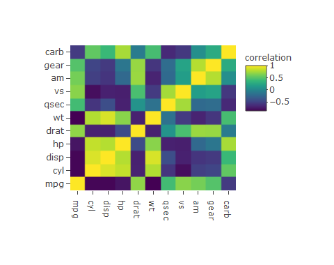

<div align="center">
 
[](https://kmaheshkulkarni.github.io/corrly/)

# Corrly is a Data Visualization Package For Manufacturing Process.

<!-- badges: start -->
[](https://www.repostatus.org/#wip)
<!-- badges: end -->

- [Home page](https://github.com/kmaheshkulkarni/corrly/index.html)

## Install Corrly

``` r
# install.packages("devtools")
# devtools::install_github("kmaheshKulkarni/corrly")
```

## Correlation Scatter Plot

``` r
library(plotly)
library(corrly)
spearman<- corr_coef_spearman(variable1= cars$speed, variable2=cars$dist, decimal = 2)
corr_scatterly(data=cars,x=cars$speed,y=cars$dist,corr_coef=spearman,xname="speed",yname="dist")
```


## Correlation Matrix Plot

``` r
library(plotly)
library(corrly)
matrixly(data = mtcars)
```


