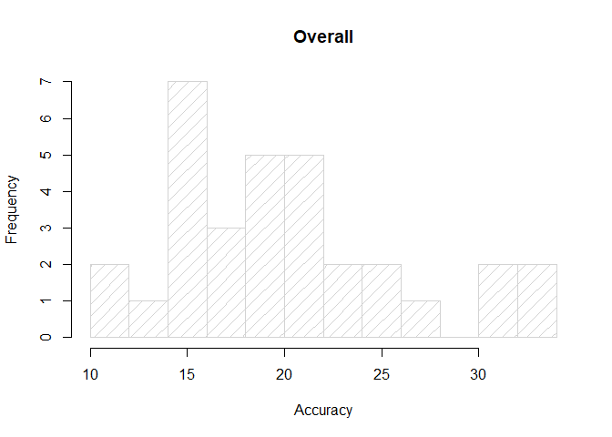

corrlY
================

# <a href='https://maheshkulkarnix.github.io/corrlY/'></a>

### Corrly is a Data Visualization Package For All Types of Correlation Charts using Plotly Package.

## Install Corrly

``` r
library(plotly)
library(htmltools)
library(corrlY)
# install.packages("devtools")
#devtools::install_github("maheshKulkarniX/corrlY")
```

## correlation Coeficient using kendall Method

``` r
# source("R/corr_coef_kendall.R")
# Example: 
corr_coef_kendall(variable1= mtcars$cyl, variable2=mtcars$carb, decimal = 2) 
```

    ## [1] 0.47

## correlation Coeficient using pearson Method

``` r
# Example: 
# source("R/corr_coef_pearson.R")
corr_coef_pearson(variable1= mtcars$disp, variable2=mtcars$hp, decimal = 2)
```

    ## [1] 0.79

## correlation Coeficient using spearman Method

``` r
# Example:
# source("R/corr_coef_spearman.R")
corr_coef_spearman(variable1= cars$speed, variable2=cars$dist, decimal = 2)
```

    ## [1] 0.83

## Correlation Scatter Plot

``` r
# Example: 
# source("R/corr_scatterly.R")
spearman<- corr_coef_spearman(variable1= cars$speed, variable2=cars$dist, decimal = 2)
corr_scatterly(data=cars,x=cars$speed,y=cars$dist,corr_coef=spearman,xname="speed",yname="dist")
```

<!--html_preserve-->

<div id="htmlwidget-b9baaf28a0f634e4d231" class="plotly html-widget" style="width:672px;height:480px;">

</div>

<script type="application/json" data-for="htmlwidget-b9baaf28a0f634e4d231">{"x":{"visdat":{"3e886a6f50f8":["function () ","plotlyVisDat"]},"cur_data":"3e886a6f50f8","attrs":{"3e886a6f50f8":{"x":[4,4,7,7,8,9,10,10,10,11,11,12,12,12,12,13,13,13,13,14,14,14,14,15,15,15,16,16,17,17,17,18,18,18,18,19,19,19,20,20,20,20,20,22,23,24,24,24,24,25],"y":[2,10,4,22,16,10,18,26,34,17,28,14,20,24,28,26,34,34,46,26,36,60,80,20,26,54,32,40,32,40,50,42,56,76,84,36,46,68,32,48,52,56,64,66,54,70,92,93,120,85],"alpha_stroke":1,"sizes":[10,100],"spans":[1,20],"type":"scatter","mode":"markers","marker":{"size":15,"opacity":0.8},"showlegend":true,"text":["42","410","74","722","816","910","1018","1026","1034","1117","1128","1214","1220","1224","1228","1326","1334","1334","1346","1426","1436","1460","1480","1520","1526","1554","1632","1640","1732","1740","1750","1842","1856","1876","1884","1936","1946","1968","2032","2048","2052","2056","2064","2266","2354","2470","2492","2493","24120","2585"],"name":"","inherit":true},"3e886a6f50f8.1":{"x":[4,4,7,7,8,9,10,10,10,11,11,12,12,12,12,13,13,13,13,14,14,14,14,15,15,15,16,16,17,17,17,18,18,18,18,19,19,19,20,20,20,20,20,22,23,24,24,24,24,25],"y":[-1.84945985401474,-1.84945985401462,9.94776642335769,9.94776642335769,13.8801751824818,17.8125839416059,21.7449927007299,21.7449927007299,21.7449927007299,25.677401459854,25.677401459854,29.6098102189781,29.6098102189781,29.6098102189781,29.6098102189781,33.5422189781022,33.5422189781022,33.5422189781022,33.5422189781022,37.4746277372263,37.4746277372263,37.4746277372263,37.4746277372263,41.4070364963504,41.4070364963504,41.4070364963504,45.3394452554745,45.3394452554745,49.2718540145985,49.2718540145985,49.2718540145985,53.2042627737226,53.2042627737226,53.2042627737226,53.2042627737226,57.1366715328467,57.1366715328467,57.1366715328467,61.0690802919708,61.0690802919708,61.0690802919708,61.0690802919708,61.0690802919708,68.933897810219,72.8663065693431,76.7987153284671,76.7987153284671,76.7987153284671,76.7987153284672,80.7311240875912],"alpha_stroke":1,"sizes":[10,100],"spans":[1,20],"type":"scatter","mode":"lines","line":{"color":"rgb(250,128,114)","width":3},"showlegend":true,"text":{},"name":"Best Fit Line","inherit":true}},"layout":{"margin":{"b":40,"l":60,"t":25,"r":10},"xaxis":{"domain":[0,1],"automargin":true,"title":"speed"},"yaxis":{"domain":[0,1],"automargin":true,"title":"dist","showlegend":true},"legend":{"orientation":"h","xanchor":"bottom","x":0.4,"y":-0.3,"bordercolor":"#333","borderwidth":2},"hovermode":"closest","showlegend":true},"source":"A","config":{"showSendToCloud":false,"displaylogo":false,"collaborate":false},"data":[{"x":[4,4,7,7,8,9,10,10,10,11,11,12,12,12,12,13,13,13,13,14,14,14,14,15,15,15,16,16,17,17,17,18,18,18,18,19,19,19,20,20,20,20,20,22,23,24,24,24,24,25],"y":[2,10,4,22,16,10,18,26,34,17,28,14,20,24,28,26,34,34,46,26,36,60,80,20,26,54,32,40,32,40,50,42,56,76,84,36,46,68,32,48,52,56,64,66,54,70,92,93,120,85],"type":"scatter","mode":"markers","marker":{"color":"rgba(31,119,180,1)","size":15,"opacity":0.8,"line":{"color":"rgba(31,119,180,1)"}},"showlegend":true,"text":["42","410","74","722","816","910","1018","1026","1034","1117","1128","1214","1220","1224","1228","1326","1334","1334","1346","1426","1436","1460","1480","1520","1526","1554","1632","1640","1732","1740","1750","1842","1856","1876","1884","1936","1946","1968","2032","2048","2052","2056","2064","2266","2354","2470","2492","2493","24120","2585"],"name":"","error_y":{"color":"rgba(31,119,180,1)"},"error_x":{"color":"rgba(31,119,180,1)"},"line":{"color":"rgba(31,119,180,1)"},"xaxis":"x","yaxis":"y","frame":null},{"x":[4,4,7,7,8,9,10,10,10,11,11,12,12,12,12,13,13,13,13,14,14,14,14,15,15,15,16,16,17,17,17,18,18,18,18,19,19,19,20,20,20,20,20,22,23,24,24,24,24,25],"y":[-1.84945985401474,-1.84945985401462,9.94776642335769,9.94776642335769,13.8801751824818,17.8125839416059,21.7449927007299,21.7449927007299,21.7449927007299,25.677401459854,25.677401459854,29.6098102189781,29.6098102189781,29.6098102189781,29.6098102189781,33.5422189781022,33.5422189781022,33.5422189781022,33.5422189781022,37.4746277372263,37.4746277372263,37.4746277372263,37.4746277372263,41.4070364963504,41.4070364963504,41.4070364963504,45.3394452554745,45.3394452554745,49.2718540145985,49.2718540145985,49.2718540145985,53.2042627737226,53.2042627737226,53.2042627737226,53.2042627737226,57.1366715328467,57.1366715328467,57.1366715328467,61.0690802919708,61.0690802919708,61.0690802919708,61.0690802919708,61.0690802919708,68.933897810219,72.8663065693431,76.7987153284671,76.7987153284671,76.7987153284671,76.7987153284672,80.7311240875912],"type":"scatter","mode":"lines","line":{"color":"rgb(250,128,114)","width":3},"showlegend":true,"text":["Correlation Coefitient R = 0.83","Correlation Coefitient R = 0.83","Correlation Coefitient R = 0.83","Correlation Coefitient R = 0.83","Correlation Coefitient R = 0.83","Correlation Coefitient R = 0.83","Correlation Coefitient R = 0.83","Correlation Coefitient R = 0.83","Correlation Coefitient R = 0.83","Correlation Coefitient R = 0.83","Correlation Coefitient R = 0.83","Correlation Coefitient R = 0.83","Correlation Coefitient R = 0.83","Correlation Coefitient R = 0.83","Correlation Coefitient R = 0.83","Correlation Coefitient R = 0.83","Correlation Coefitient R = 0.83","Correlation Coefitient R = 0.83","Correlation Coefitient R = 0.83","Correlation Coefitient R = 0.83","Correlation Coefitient R = 0.83","Correlation Coefitient R = 0.83","Correlation Coefitient R = 0.83","Correlation Coefitient R = 0.83","Correlation Coefitient R = 0.83","Correlation Coefitient R = 0.83","Correlation Coefitient R = 0.83","Correlation Coefitient R = 0.83","Correlation Coefitient R = 0.83","Correlation Coefitient R = 0.83","Correlation Coefitient R = 0.83","Correlation Coefitient R = 0.83","Correlation Coefitient R = 0.83","Correlation Coefitient R = 0.83","Correlation Coefitient R = 0.83","Correlation Coefitient R = 0.83","Correlation Coefitient R = 0.83","Correlation Coefitient R = 0.83","Correlation Coefitient R = 0.83","Correlation Coefitient R = 0.83","Correlation Coefitient R = 0.83","Correlation Coefitient R = 0.83","Correlation Coefitient R = 0.83","Correlation Coefitient R = 0.83","Correlation Coefitient R = 0.83","Correlation Coefitient R = 0.83","Correlation Coefitient R = 0.83","Correlation Coefitient R = 0.83","Correlation Coefitient R = 0.83","Correlation Coefitient R = 0.83"],"name":"Best Fit Line","marker":{"color":"rgba(255,127,14,1)","line":{"color":"rgba(255,127,14,1)"}},"error_y":{"color":"rgba(255,127,14,1)"},"error_x":{"color":"rgba(255,127,14,1)"},"xaxis":"x","yaxis":"y","frame":null}],"highlight":{"on":"plotly_click","persistent":false,"dynamic":false,"selectize":false,"opacityDim":0.2,"selected":{"opacity":1},"debounce":0},"shinyEvents":["plotly_hover","plotly_click","plotly_selected","plotly_relayout","plotly_brushed","plotly_brushing","plotly_clickannotation","plotly_doubleclick","plotly_deselect","plotly_afterplot"],"base_url":"https://plot.ly"},"evals":[],"jsHooks":[]}</script>

<!--/html_preserve-->

## Correlation Matrix Plot

``` r
# Example: 
# source("R/matrixly.R")
matrixly(data = mtcars)
```

<!--html_preserve-->

<div id="htmlwidget-d80fe342b695bc359976" class="plotly html-widget" style="width:672px;height:480px;">

</div>

<script type="application/json" data-for="htmlwidget-d80fe342b695bc359976">{"x":{"visdat":{"3e887a8d1878":["function () ","plotlyVisDat"]},"cur_data":"3e887a8d1878","attrs":{"3e887a8d1878":{"x":["mpg","cyl","disp","hp","drat","wt","qsec","vs","am","gear","carb"],"y":["mpg","cyl","disp","hp","drat","wt","qsec","vs","am","gear","carb"],"z":[[1,-0.85,-0.85,-0.78,0.68,-0.87,0.42,0.66,0.6,0.48,-0.55],[-0.85,1,0.9,0.83,-0.7,0.78,-0.59,-0.81,-0.52,-0.49,0.53],[-0.85,0.9,1,0.79,-0.71,0.89,-0.43,-0.71,-0.59,-0.56,0.39],[-0.78,0.83,0.79,1,-0.45,0.66,-0.71,-0.72,-0.24,-0.13,0.75],[0.68,-0.7,-0.71,-0.45,1,-0.71,0.09,0.44,0.71,0.7,-0.09],[-0.87,0.78,0.89,0.66,-0.71,1,-0.17,-0.55,-0.69,-0.58,0.43],[0.42,-0.59,-0.43,-0.71,0.09,-0.17,1,0.74,-0.23,-0.21,-0.66],[0.66,-0.81,-0.71,-0.72,0.44,-0.55,0.74,1,0.17,0.21,-0.57],[0.6,-0.52,-0.59,-0.24,0.71,-0.69,-0.23,0.17,1,0.79,0.06],[0.48,-0.49,-0.56,-0.13,0.7,-0.58,-0.21,0.21,0.79,1,0.27],[-0.55,0.53,0.39,0.75,-0.09,0.43,-0.66,-0.57,0.06,0.27,1]],"key":[[1,-0.85,-0.85,-0.78,0.68,-0.87,0.42,0.66,0.6,0.48,-0.55],[-0.85,1,0.9,0.83,-0.7,0.78,-0.59,-0.81,-0.52,-0.49,0.53],[-0.85,0.9,1,0.79,-0.71,0.89,-0.43,-0.71,-0.59,-0.56,0.39],[-0.78,0.83,0.79,1,-0.45,0.66,-0.71,-0.72,-0.24,-0.13,0.75],[0.68,-0.7,-0.71,-0.45,1,-0.71,0.09,0.44,0.71,0.7,-0.09],[-0.87,0.78,0.89,0.66,-0.71,1,-0.17,-0.55,-0.69,-0.58,0.43],[0.42,-0.59,-0.43,-0.71,0.09,-0.17,1,0.74,-0.23,-0.21,-0.66],[0.66,-0.81,-0.71,-0.72,0.44,-0.55,0.74,1,0.17,0.21,-0.57],[0.6,-0.52,-0.59,-0.24,0.71,-0.69,-0.23,0.17,1,0.79,0.06],[0.48,-0.49,-0.56,-0.13,0.7,-0.58,-0.21,0.21,0.79,1,0.27],[-0.55,0.53,0.39,0.75,-0.09,0.43,-0.66,-0.57,0.06,0.27,1]],"color":{},"alpha_stroke":1,"sizes":[10,100],"spans":[1,20],"type":"heatmap"}},"layout":{"margin":{"b":40,"l":60,"t":25,"r":10},"xaxis":{"domain":[0,1],"automargin":true,"title":""},"yaxis":{"domain":[0,1],"automargin":true,"title":""},"legend":{"orientation":"h","xanchor":"bottom","x":0.45,"y":-0.3,"bordercolor":"#333","borderwidth":2,"yanchor":"top"},"scene":{"zaxis":{"title":[]}},"hovermode":"closest","showlegend":false},"source":"heatplot","config":{"showSendToCloud":false,"displaylogo":false,"collaborate":false},"data":[{"colorbar":{"title":"correlation","ticklen":2,"len":0.5,"lenmode":"fraction","y":1,"yanchor":"top"},"colorscale":[["0","rgba(68,1,84,1)"],["0.0416666666666666","rgba(70,19,97,1)"],["0.0833333333333334","rgba(72,32,111,1)"],["0.125","rgba(71,45,122,1)"],["0.166666666666667","rgba(68,58,128,1)"],["0.208333333333333","rgba(64,70,135,1)"],["0.25","rgba(60,82,138,1)"],["0.291666666666667","rgba(56,93,140,1)"],["0.333333333333333","rgba(49,104,142,1)"],["0.375","rgba(46,114,142,1)"],["0.416666666666667","rgba(42,123,142,1)"],["0.458333333333333","rgba(38,133,141,1)"],["0.5","rgba(37,144,140,1)"],["0.541666666666667","rgba(33,154,138,1)"],["0.583333333333333","rgba(39,164,133,1)"],["0.625","rgba(47,174,127,1)"],["0.666666666666667","rgba(53,183,121,1)"],["0.708333333333333","rgba(79,191,110,1)"],["0.75","rgba(98,199,98,1)"],["0.791666666666667","rgba(119,207,85,1)"],["0.833333333333333","rgba(147,214,70,1)"],["0.875","rgba(172,220,52,1)"],["0.916666666666667","rgba(199,225,42,1)"],["0.958333333333333","rgba(226,228,40,1)"],["1","rgba(253,231,37,1)"]],"showscale":true,"x":["mpg","cyl","disp","hp","drat","wt","qsec","vs","am","gear","carb"],"y":["mpg","cyl","disp","hp","drat","wt","qsec","vs","am","gear","carb"],"z":[[1,-0.85,-0.85,-0.78,0.68,-0.87,0.42,0.66,0.6,0.48,-0.55],[-0.85,1,0.9,0.83,-0.7,0.78,-0.59,-0.81,-0.52,-0.49,0.53],[-0.85,0.9,1,0.79,-0.71,0.89,-0.43,-0.71,-0.59,-0.56,0.39],[-0.78,0.83,0.79,1,-0.45,0.66,-0.71,-0.72,-0.24,-0.13,0.75],[0.68,-0.7,-0.71,-0.45,1,-0.71,0.09,0.44,0.71,0.7,-0.09],[-0.87,0.78,0.89,0.66,-0.71,1,-0.17,-0.55,-0.69,-0.58,0.43],[0.42,-0.59,-0.43,-0.71,0.09,-0.17,1,0.74,-0.23,-0.21,-0.66],[0.66,-0.81,-0.71,-0.72,0.44,-0.55,0.74,1,0.17,0.21,-0.57],[0.6,-0.52,-0.59,-0.24,0.71,-0.69,-0.23,0.17,1,0.79,0.06],[0.48,-0.49,-0.56,-0.13,0.7,-0.58,-0.21,0.21,0.79,1,0.27],[-0.55,0.53,0.39,0.75,-0.09,0.43,-0.66,-0.57,0.06,0.27,1]],"key":["1","-0.85","-0.85","-0.78","0.68","-0.87","0.42","0.66","0.6","0.48","-0.55","-0.85","1","0.9","0.83","-0.7","0.78","-0.59","-0.81","-0.52","-0.49","0.53","-0.85","0.9","1","0.79","-0.71","0.89","-0.43","-0.71","-0.59","-0.56","0.39","-0.78","0.83","0.79","1","-0.45","0.66","-0.71","-0.72","-0.24","-0.13","0.75","0.68","-0.7","-0.71","-0.45","1","-0.71","0.09","0.44","0.71","0.7","-0.09","-0.87","0.78","0.89","0.66","-0.71","1","-0.17","-0.55","-0.69","-0.58","0.43","0.42","-0.59","-0.43","-0.71","0.09","-0.17","1","0.74","-0.23","-0.21","-0.66","0.66","-0.81","-0.71","-0.72","0.44","-0.55","0.74","1","0.17","0.21","-0.57","0.6","-0.52","-0.59","-0.24","0.71","-0.69","-0.23","0.17","1","0.79","0.06","0.48","-0.49","-0.56","-0.13","0.7","-0.58","-0.21","0.21","0.79","1","0.27","-0.55","0.53","0.39","0.75","-0.09","0.43","-0.66","-0.57","0.06","0.27","1"],"type":"heatmap","marker":{"line":{"colorbar":{"title":"","ticklen":2},"cmin":-0.87,"cmax":1,"colorscale":[["0","rgba(68,1,84,1)"],["0.0416666666666666","rgba(70,19,97,1)"],["0.0833333333333334","rgba(72,32,111,1)"],["0.125","rgba(71,45,122,1)"],["0.166666666666667","rgba(68,58,128,1)"],["0.208333333333333","rgba(64,70,135,1)"],["0.25","rgba(60,82,138,1)"],["0.291666666666667","rgba(56,93,140,1)"],["0.333333333333333","rgba(49,104,142,1)"],["0.375","rgba(46,114,142,1)"],["0.416666666666667","rgba(42,123,142,1)"],["0.458333333333333","rgba(38,133,141,1)"],["0.5","rgba(37,144,140,1)"],["0.541666666666667","rgba(33,154,138,1)"],["0.583333333333333","rgba(39,164,133,1)"],["0.625","rgba(47,174,127,1)"],["0.666666666666667","rgba(53,183,121,1)"],["0.708333333333333","rgba(79,191,110,1)"],["0.75","rgba(98,199,98,1)"],["0.791666666666667","rgba(119,207,85,1)"],["0.833333333333333","rgba(147,214,70,1)"],["0.875","rgba(172,220,52,1)"],["0.916666666666667","rgba(199,225,42,1)"],["0.958333333333333","rgba(226,228,40,1)"],["1","rgba(253,231,37,1)"]],"showscale":false,"color":[[1,-0.85,-0.85,-0.78,0.68,-0.87,0.42,0.66,0.6,0.48,-0.55],[-0.85,1,0.9,0.83,-0.7,0.78,-0.59,-0.81,-0.52,-0.49,0.53],[-0.85,0.9,1,0.79,-0.71,0.89,-0.43,-0.71,-0.59,-0.56,0.39],[-0.78,0.83,0.79,1,-0.45,0.66,-0.71,-0.72,-0.24,-0.13,0.75],[0.68,-0.7,-0.71,-0.45,1,-0.71,0.09,0.44,0.71,0.7,-0.09],[-0.87,0.78,0.89,0.66,-0.71,1,-0.17,-0.55,-0.69,-0.58,0.43],[0.42,-0.59,-0.43,-0.71,0.09,-0.17,1,0.74,-0.23,-0.21,-0.66],[0.66,-0.81,-0.71,-0.72,0.44,-0.55,0.74,1,0.17,0.21,-0.57],[0.6,-0.52,-0.59,-0.24,0.71,-0.69,-0.23,0.17,1,0.79,0.06],[0.48,-0.49,-0.56,-0.13,0.7,-0.58,-0.21,0.21,0.79,1,0.27],[-0.55,0.53,0.39,0.75,-0.09,0.43,-0.66,-0.57,0.06,0.27,1]]}},"xaxis":"x","yaxis":"y","_isNestedKey":false,"frame":null}],"highlight":{"on":"plotly_click","persistent":false,"dynamic":false,"selectize":false,"opacityDim":0.2,"selected":{"opacity":1},"debounce":0},"shinyEvents":["plotly_hover","plotly_click","plotly_selected","plotly_relayout","plotly_brushed","plotly_brushing","plotly_clickannotation","plotly_doubleclick","plotly_deselect","plotly_afterplot"],"base_url":"https://plot.ly"},"evals":[],"jsHooks":[]}</script>

<!--/html_preserve-->

## Autocorrelation

``` r
#Example:- 
series<- c(mtcars$gear, mtcars$carb)
acf_ly(series)
```

<!--html_preserve-->

<div id="htmlwidget-b765d0657b3a4e489432" class="plotly html-widget" style="width:672px;height:480px;">

</div>

<script type="application/json" data-for="htmlwidget-b765d0657b3a4e489432">{"x":{"visdat":{"3e885dca7b97":["function () ","plotlyVisDat"]},"cur_data":"3e885dca7b97","attrs":{"3e885dca7b97":{"x":{},"y":{},"showlegend":false,"mode":"markers","name":"LAG, ACF","color":{},"alpha_stroke":1,"sizes":[10,100],"spans":[1,20],"type":"bar"},"3e885dca7b97.1":{"x":{},"y":0.244995498067507,"showlegend":false,"mode":"markers","name":"Positive Significance Level","color":{},"alpha_stroke":1,"sizes":[10,100],"spans":[1,20],"type":"scatter","marker":{"colorbar":{"title":"Correlation Coeficient"}},"inherit":true},"3e885dca7b97.2":{"x":{},"y":-0.244995498067507,"showlegend":false,"mode":"markers","name":"Negative Significance Level","color":{},"alpha_stroke":1,"sizes":[10,100],"spans":[1,20],"type":"scatter","marker":{"colorbar":{"title":"Correlation Coeficient"}},"inherit":true},"3e885dca7b97.3":{"x":{},"y":0.244995498067507,"showlegend":true,"mode":"lines","name":"Positive Significance Level","color":{},"alpha_stroke":1,"sizes":[10,100],"spans":[1,20],"type":"scatter","line":{"color":"rgb(22, 96, 167)"},"inherit":true},"3e885dca7b97.4":{"x":{},"y":-0.244995498067507,"showlegend":true,"mode":"lines","name":"Negative Significance Level","color":{},"alpha_stroke":1,"sizes":[10,100],"spans":[1,20],"type":"scatter","line":{"color":"#07A4B5"},"inherit":true}},"layout":{"margin":{"b":40,"l":60,"t":25,"r":10},"xaxis":{"domain":[0,1],"automargin":true,"title":"LAG"},"yaxis":{"domain":[0,1],"automargin":true,"title":"ACF"},"hovermode":"closest","showlegend":true,"legend":{"yanchor":"top","y":0.5}},"source":"A","config":{"showSendToCloud":false,"displaylogo":false,"collaborate":false},"data":[{"x":[0,1,2,3,4,5,6,7,8,9,10,11,12,13,14,15,16,17,18],"y":[1,0.499431818181818,0.248863636363636,0.0664772727272727,-0.0772727272727273,-0.0619318181818182,-0.0465909090909091,-0.0517045454545455,-0.143181818181818,-0.148295454545455,-0.194318181818182,-0.203977272727273,-0.0636363636363636,-0.0232954545454545,0.182954545454545,0.16875,0.115909090909091,0.126704545454545,0.0761363636363636],"showlegend":false,"mode":"markers","name":"LAG, ACF","type":"bar","marker":{"colorbar":{"title":"acf<br />acf<br />acf<br />acf<br />acf","ticklen":2},"cmin":-0.203977272727273,"cmax":1,"colorscale":[["0","rgba(68,1,84,1)"],["0.0416666666666667","rgba(70,19,97,1)"],["0.0833333333333333","rgba(72,32,111,1)"],["0.125","rgba(71,45,122,1)"],["0.166666666666667","rgba(68,58,128,1)"],["0.208333333333333","rgba(64,70,135,1)"],["0.25","rgba(60,82,138,1)"],["0.291666666666667","rgba(56,93,140,1)"],["0.333333333333333","rgba(49,104,142,1)"],["0.375","rgba(46,114,142,1)"],["0.416666666666667","rgba(42,123,142,1)"],["0.458333333333333","rgba(38,133,141,1)"],["0.5","rgba(37,144,140,1)"],["0.541666666666667","rgba(33,154,138,1)"],["0.583333333333333","rgba(39,164,133,1)"],["0.625","rgba(47,174,127,1)"],["0.666666666666667","rgba(53,183,121,1)"],["0.708333333333333","rgba(79,191,110,1)"],["0.75","rgba(98,199,98,1)"],["0.791666666666667","rgba(119,207,85,1)"],["0.833333333333333","rgba(147,214,70,1)"],["0.875","rgba(172,220,52,1)"],["0.916666666666667","rgba(199,225,42,1)"],["0.958333333333333","rgba(226,228,40,1)"],["1","rgba(253,231,37,1)"]],"showscale":false,"color":[1,0.499431818181818,0.248863636363636,0.0664772727272727,-0.0772727272727273,-0.0619318181818182,-0.0465909090909091,-0.0517045454545455,-0.143181818181818,-0.148295454545455,-0.194318181818182,-0.203977272727273,-0.0636363636363636,-0.0232954545454545,0.182954545454545,0.16875,0.115909090909091,0.126704545454545,0.0761363636363636],"line":{"colorbar":{"title":"","ticklen":2},"cmin":-0.203977272727273,"cmax":1,"colorscale":[["0","rgba(68,1,84,1)"],["0.0416666666666667","rgba(70,19,97,1)"],["0.0833333333333333","rgba(72,32,111,1)"],["0.125","rgba(71,45,122,1)"],["0.166666666666667","rgba(68,58,128,1)"],["0.208333333333333","rgba(64,70,135,1)"],["0.25","rgba(60,82,138,1)"],["0.291666666666667","rgba(56,93,140,1)"],["0.333333333333333","rgba(49,104,142,1)"],["0.375","rgba(46,114,142,1)"],["0.416666666666667","rgba(42,123,142,1)"],["0.458333333333333","rgba(38,133,141,1)"],["0.5","rgba(37,144,140,1)"],["0.541666666666667","rgba(33,154,138,1)"],["0.583333333333333","rgba(39,164,133,1)"],["0.625","rgba(47,174,127,1)"],["0.666666666666667","rgba(53,183,121,1)"],["0.708333333333333","rgba(79,191,110,1)"],["0.75","rgba(98,199,98,1)"],["0.791666666666667","rgba(119,207,85,1)"],["0.833333333333333","rgba(147,214,70,1)"],["0.875","rgba(172,220,52,1)"],["0.916666666666667","rgba(199,225,42,1)"],["0.958333333333333","rgba(226,228,40,1)"],["1","rgba(253,231,37,1)"]],"showscale":false,"color":[1,0.499431818181818,0.248863636363636,0.0664772727272727,-0.0772727272727273,-0.0619318181818182,-0.0465909090909091,-0.0517045454545455,-0.143181818181818,-0.148295454545455,-0.194318181818182,-0.203977272727273,-0.0636363636363636,-0.0232954545454545,0.182954545454545,0.16875,0.115909090909091,0.126704545454545,0.0761363636363636]}},"xaxis":"x","yaxis":"y","frame":null},{"x":[0,1,2,3,4,5,6,7,8,9,10,11,12,13,14,15,16,17,18],"y":[0.244995498067507,0.244995498067507,0.244995498067507,0.244995498067507,0.244995498067507,0.244995498067507,0.244995498067507,0.244995498067507,0.244995498067507,0.244995498067507,0.244995498067507,0.244995498067507,0.244995498067507,0.244995498067507,0.244995498067507,0.244995498067507,0.244995498067507,0.244995498067507,0.244995498067507],"showlegend":false,"mode":"markers","name":"Positive Significance Level","type":"scatter","marker":{"colorbar":{"title":"Correlation Coeficient","ticklen":2},"cmin":-0.203977272727273,"cmax":1,"colorscale":[["0","rgba(68,1,84,1)"],["0.0416666666666667","rgba(70,19,97,1)"],["0.0833333333333333","rgba(72,32,111,1)"],["0.125","rgba(71,45,122,1)"],["0.166666666666667","rgba(68,58,128,1)"],["0.208333333333333","rgba(64,70,135,1)"],["0.25","rgba(60,82,138,1)"],["0.291666666666667","rgba(56,93,140,1)"],["0.333333333333333","rgba(49,104,142,1)"],["0.375","rgba(46,114,142,1)"],["0.416666666666667","rgba(42,123,142,1)"],["0.458333333333333","rgba(38,133,141,1)"],["0.5","rgba(37,144,140,1)"],["0.541666666666667","rgba(33,154,138,1)"],["0.583333333333333","rgba(39,164,133,1)"],["0.625","rgba(47,174,127,1)"],["0.666666666666667","rgba(53,183,121,1)"],["0.708333333333333","rgba(79,191,110,1)"],["0.75","rgba(98,199,98,1)"],["0.791666666666667","rgba(119,207,85,1)"],["0.833333333333333","rgba(147,214,70,1)"],["0.875","rgba(172,220,52,1)"],["0.916666666666667","rgba(199,225,42,1)"],["0.958333333333333","rgba(226,228,40,1)"],["1","rgba(253,231,37,1)"]],"showscale":false,"color":[1,0.499431818181818,0.248863636363636,0.0664772727272727,-0.0772727272727273,-0.0619318181818182,-0.0465909090909091,-0.0517045454545455,-0.143181818181818,-0.148295454545455,-0.194318181818182,-0.203977272727273,-0.0636363636363636,-0.0232954545454545,0.182954545454545,0.16875,0.115909090909091,0.126704545454545,0.0761363636363636],"line":{"colorbar":{"title":"","ticklen":2},"cmin":-0.203977272727273,"cmax":1,"colorscale":[["0","rgba(68,1,84,1)"],["0.0416666666666667","rgba(70,19,97,1)"],["0.0833333333333333","rgba(72,32,111,1)"],["0.125","rgba(71,45,122,1)"],["0.166666666666667","rgba(68,58,128,1)"],["0.208333333333333","rgba(64,70,135,1)"],["0.25","rgba(60,82,138,1)"],["0.291666666666667","rgba(56,93,140,1)"],["0.333333333333333","rgba(49,104,142,1)"],["0.375","rgba(46,114,142,1)"],["0.416666666666667","rgba(42,123,142,1)"],["0.458333333333333","rgba(38,133,141,1)"],["0.5","rgba(37,144,140,1)"],["0.541666666666667","rgba(33,154,138,1)"],["0.583333333333333","rgba(39,164,133,1)"],["0.625","rgba(47,174,127,1)"],["0.666666666666667","rgba(53,183,121,1)"],["0.708333333333333","rgba(79,191,110,1)"],["0.75","rgba(98,199,98,1)"],["0.791666666666667","rgba(119,207,85,1)"],["0.833333333333333","rgba(147,214,70,1)"],["0.875","rgba(172,220,52,1)"],["0.916666666666667","rgba(199,225,42,1)"],["0.958333333333333","rgba(226,228,40,1)"],["1","rgba(253,231,37,1)"]],"showscale":false,"color":[1,0.499431818181818,0.248863636363636,0.0664772727272727,-0.0772727272727273,-0.0619318181818182,-0.0465909090909091,-0.0517045454545455,-0.143181818181818,-0.148295454545455,-0.194318181818182,-0.203977272727273,-0.0636363636363636,-0.0232954545454545,0.182954545454545,0.16875,0.115909090909091,0.126704545454545,0.0761363636363636]}},"xaxis":"x","yaxis":"y","frame":null},{"x":[0,1,2,3,4,5,6,7,8,9,10,11,12,13,14,15,16,17,18],"y":[-0.244995498067507,-0.244995498067507,-0.244995498067507,-0.244995498067507,-0.244995498067507,-0.244995498067507,-0.244995498067507,-0.244995498067507,-0.244995498067507,-0.244995498067507,-0.244995498067507,-0.244995498067507,-0.244995498067507,-0.244995498067507,-0.244995498067507,-0.244995498067507,-0.244995498067507,-0.244995498067507,-0.244995498067507],"showlegend":false,"mode":"markers","name":"Negative Significance Level","type":"scatter","marker":{"colorbar":{"title":"Correlation Coeficient","ticklen":2},"cmin":-0.203977272727273,"cmax":1,"colorscale":[["0","rgba(68,1,84,1)"],["0.0416666666666667","rgba(70,19,97,1)"],["0.0833333333333333","rgba(72,32,111,1)"],["0.125","rgba(71,45,122,1)"],["0.166666666666667","rgba(68,58,128,1)"],["0.208333333333333","rgba(64,70,135,1)"],["0.25","rgba(60,82,138,1)"],["0.291666666666667","rgba(56,93,140,1)"],["0.333333333333333","rgba(49,104,142,1)"],["0.375","rgba(46,114,142,1)"],["0.416666666666667","rgba(42,123,142,1)"],["0.458333333333333","rgba(38,133,141,1)"],["0.5","rgba(37,144,140,1)"],["0.541666666666667","rgba(33,154,138,1)"],["0.583333333333333","rgba(39,164,133,1)"],["0.625","rgba(47,174,127,1)"],["0.666666666666667","rgba(53,183,121,1)"],["0.708333333333333","rgba(79,191,110,1)"],["0.75","rgba(98,199,98,1)"],["0.791666666666667","rgba(119,207,85,1)"],["0.833333333333333","rgba(147,214,70,1)"],["0.875","rgba(172,220,52,1)"],["0.916666666666667","rgba(199,225,42,1)"],["0.958333333333333","rgba(226,228,40,1)"],["1","rgba(253,231,37,1)"]],"showscale":false,"color":[1,0.499431818181818,0.248863636363636,0.0664772727272727,-0.0772727272727273,-0.0619318181818182,-0.0465909090909091,-0.0517045454545455,-0.143181818181818,-0.148295454545455,-0.194318181818182,-0.203977272727273,-0.0636363636363636,-0.0232954545454545,0.182954545454545,0.16875,0.115909090909091,0.126704545454545,0.0761363636363636],"line":{"colorbar":{"title":"","ticklen":2},"cmin":-0.203977272727273,"cmax":1,"colorscale":[["0","rgba(68,1,84,1)"],["0.0416666666666667","rgba(70,19,97,1)"],["0.0833333333333333","rgba(72,32,111,1)"],["0.125","rgba(71,45,122,1)"],["0.166666666666667","rgba(68,58,128,1)"],["0.208333333333333","rgba(64,70,135,1)"],["0.25","rgba(60,82,138,1)"],["0.291666666666667","rgba(56,93,140,1)"],["0.333333333333333","rgba(49,104,142,1)"],["0.375","rgba(46,114,142,1)"],["0.416666666666667","rgba(42,123,142,1)"],["0.458333333333333","rgba(38,133,141,1)"],["0.5","rgba(37,144,140,1)"],["0.541666666666667","rgba(33,154,138,1)"],["0.583333333333333","rgba(39,164,133,1)"],["0.625","rgba(47,174,127,1)"],["0.666666666666667","rgba(53,183,121,1)"],["0.708333333333333","rgba(79,191,110,1)"],["0.75","rgba(98,199,98,1)"],["0.791666666666667","rgba(119,207,85,1)"],["0.833333333333333","rgba(147,214,70,1)"],["0.875","rgba(172,220,52,1)"],["0.916666666666667","rgba(199,225,42,1)"],["0.958333333333333","rgba(226,228,40,1)"],["1","rgba(253,231,37,1)"]],"showscale":false,"color":[1,0.499431818181818,0.248863636363636,0.0664772727272727,-0.0772727272727273,-0.0619318181818182,-0.0465909090909091,-0.0517045454545455,-0.143181818181818,-0.148295454545455,-0.194318181818182,-0.203977272727273,-0.0636363636363636,-0.0232954545454545,0.182954545454545,0.16875,0.115909090909091,0.126704545454545,0.0761363636363636]}},"xaxis":"x","yaxis":"y","frame":null},{"x":[0,1,2,3,4,5,6,7,8,9,10,11,12,13,14,15,16,17,18],"y":[0.244995498067507,0.244995498067507,0.244995498067507,0.244995498067507,0.244995498067507,0.244995498067507,0.244995498067507,0.244995498067507,0.244995498067507,0.244995498067507,0.244995498067507,0.244995498067507,0.244995498067507,0.244995498067507,0.244995498067507,0.244995498067507,0.244995498067507,0.244995498067507,0.244995498067507],"showlegend":true,"mode":"lines","name":"Positive Significance Level","type":"scatter","line":{"color":"rgb(22, 96, 167)"},"marker":{"colorbar":{"title":"acf<br />acf<br />acf<br />acf<br />acf","ticklen":2},"cmin":-0.203977272727273,"cmax":1,"colorscale":[["0","rgba(68,1,84,1)"],["0.0416666666666667","rgba(70,19,97,1)"],["0.0833333333333333","rgba(72,32,111,1)"],["0.125","rgba(71,45,122,1)"],["0.166666666666667","rgba(68,58,128,1)"],["0.208333333333333","rgba(64,70,135,1)"],["0.25","rgba(60,82,138,1)"],["0.291666666666667","rgba(56,93,140,1)"],["0.333333333333333","rgba(49,104,142,1)"],["0.375","rgba(46,114,142,1)"],["0.416666666666667","rgba(42,123,142,1)"],["0.458333333333333","rgba(38,133,141,1)"],["0.5","rgba(37,144,140,1)"],["0.541666666666667","rgba(33,154,138,1)"],["0.583333333333333","rgba(39,164,133,1)"],["0.625","rgba(47,174,127,1)"],["0.666666666666667","rgba(53,183,121,1)"],["0.708333333333333","rgba(79,191,110,1)"],["0.75","rgba(98,199,98,1)"],["0.791666666666667","rgba(119,207,85,1)"],["0.833333333333333","rgba(147,214,70,1)"],["0.875","rgba(172,220,52,1)"],["0.916666666666667","rgba(199,225,42,1)"],["0.958333333333333","rgba(226,228,40,1)"],["1","rgba(253,231,37,1)"]],"showscale":false,"color":[1,0.499431818181818,0.248863636363636,0.0664772727272727,-0.0772727272727273,-0.0619318181818182,-0.0465909090909091,-0.0517045454545455,-0.143181818181818,-0.148295454545455,-0.194318181818182,-0.203977272727273,-0.0636363636363636,-0.0232954545454545,0.182954545454545,0.16875,0.115909090909091,0.126704545454545,0.0761363636363636],"line":{"colorbar":{"title":"","ticklen":2},"cmin":-0.203977272727273,"cmax":1,"colorscale":[["0","rgba(68,1,84,1)"],["0.0416666666666667","rgba(70,19,97,1)"],["0.0833333333333333","rgba(72,32,111,1)"],["0.125","rgba(71,45,122,1)"],["0.166666666666667","rgba(68,58,128,1)"],["0.208333333333333","rgba(64,70,135,1)"],["0.25","rgba(60,82,138,1)"],["0.291666666666667","rgba(56,93,140,1)"],["0.333333333333333","rgba(49,104,142,1)"],["0.375","rgba(46,114,142,1)"],["0.416666666666667","rgba(42,123,142,1)"],["0.458333333333333","rgba(38,133,141,1)"],["0.5","rgba(37,144,140,1)"],["0.541666666666667","rgba(33,154,138,1)"],["0.583333333333333","rgba(39,164,133,1)"],["0.625","rgba(47,174,127,1)"],["0.666666666666667","rgba(53,183,121,1)"],["0.708333333333333","rgba(79,191,110,1)"],["0.75","rgba(98,199,98,1)"],["0.791666666666667","rgba(119,207,85,1)"],["0.833333333333333","rgba(147,214,70,1)"],["0.875","rgba(172,220,52,1)"],["0.916666666666667","rgba(199,225,42,1)"],["0.958333333333333","rgba(226,228,40,1)"],["1","rgba(253,231,37,1)"]],"showscale":false,"color":[1,0.499431818181818,0.248863636363636,0.0664772727272727,-0.0772727272727273,-0.0619318181818182,-0.0465909090909091,-0.0517045454545455,-0.143181818181818,-0.148295454545455,-0.194318181818182,-0.203977272727273,-0.0636363636363636,-0.0232954545454545,0.182954545454545,0.16875,0.115909090909091,0.126704545454545,0.0761363636363636]}},"xaxis":"x","yaxis":"y","frame":null},{"x":[0,1,2,3,4,5,6,7,8,9,10,11,12,13,14,15,16,17,18],"y":[-0.244995498067507,-0.244995498067507,-0.244995498067507,-0.244995498067507,-0.244995498067507,-0.244995498067507,-0.244995498067507,-0.244995498067507,-0.244995498067507,-0.244995498067507,-0.244995498067507,-0.244995498067507,-0.244995498067507,-0.244995498067507,-0.244995498067507,-0.244995498067507,-0.244995498067507,-0.244995498067507,-0.244995498067507],"showlegend":true,"mode":"lines","name":"Negative Significance Level","type":"scatter","line":{"color":"#07A4B5"},"marker":{"colorbar":{"title":"acf<br />acf<br />acf<br />acf<br />acf","ticklen":2},"cmin":-0.203977272727273,"cmax":1,"colorscale":[["0","rgba(68,1,84,1)"],["0.0416666666666667","rgba(70,19,97,1)"],["0.0833333333333333","rgba(72,32,111,1)"],["0.125","rgba(71,45,122,1)"],["0.166666666666667","rgba(68,58,128,1)"],["0.208333333333333","rgba(64,70,135,1)"],["0.25","rgba(60,82,138,1)"],["0.291666666666667","rgba(56,93,140,1)"],["0.333333333333333","rgba(49,104,142,1)"],["0.375","rgba(46,114,142,1)"],["0.416666666666667","rgba(42,123,142,1)"],["0.458333333333333","rgba(38,133,141,1)"],["0.5","rgba(37,144,140,1)"],["0.541666666666667","rgba(33,154,138,1)"],["0.583333333333333","rgba(39,164,133,1)"],["0.625","rgba(47,174,127,1)"],["0.666666666666667","rgba(53,183,121,1)"],["0.708333333333333","rgba(79,191,110,1)"],["0.75","rgba(98,199,98,1)"],["0.791666666666667","rgba(119,207,85,1)"],["0.833333333333333","rgba(147,214,70,1)"],["0.875","rgba(172,220,52,1)"],["0.916666666666667","rgba(199,225,42,1)"],["0.958333333333333","rgba(226,228,40,1)"],["1","rgba(253,231,37,1)"]],"showscale":false,"color":[1,0.499431818181818,0.248863636363636,0.0664772727272727,-0.0772727272727273,-0.0619318181818182,-0.0465909090909091,-0.0517045454545455,-0.143181818181818,-0.148295454545455,-0.194318181818182,-0.203977272727273,-0.0636363636363636,-0.0232954545454545,0.182954545454545,0.16875,0.115909090909091,0.126704545454545,0.0761363636363636],"line":{"colorbar":{"title":"","ticklen":2},"cmin":-0.203977272727273,"cmax":1,"colorscale":[["0","rgba(68,1,84,1)"],["0.0416666666666667","rgba(70,19,97,1)"],["0.0833333333333333","rgba(72,32,111,1)"],["0.125","rgba(71,45,122,1)"],["0.166666666666667","rgba(68,58,128,1)"],["0.208333333333333","rgba(64,70,135,1)"],["0.25","rgba(60,82,138,1)"],["0.291666666666667","rgba(56,93,140,1)"],["0.333333333333333","rgba(49,104,142,1)"],["0.375","rgba(46,114,142,1)"],["0.416666666666667","rgba(42,123,142,1)"],["0.458333333333333","rgba(38,133,141,1)"],["0.5","rgba(37,144,140,1)"],["0.541666666666667","rgba(33,154,138,1)"],["0.583333333333333","rgba(39,164,133,1)"],["0.625","rgba(47,174,127,1)"],["0.666666666666667","rgba(53,183,121,1)"],["0.708333333333333","rgba(79,191,110,1)"],["0.75","rgba(98,199,98,1)"],["0.791666666666667","rgba(119,207,85,1)"],["0.833333333333333","rgba(147,214,70,1)"],["0.875","rgba(172,220,52,1)"],["0.916666666666667","rgba(199,225,42,1)"],["0.958333333333333","rgba(226,228,40,1)"],["1","rgba(253,231,37,1)"]],"showscale":false,"color":[1,0.499431818181818,0.248863636363636,0.0664772727272727,-0.0772727272727273,-0.0619318181818182,-0.0465909090909091,-0.0517045454545455,-0.143181818181818,-0.148295454545455,-0.194318181818182,-0.203977272727273,-0.0636363636363636,-0.0232954545454545,0.182954545454545,0.16875,0.115909090909091,0.126704545454545,0.0761363636363636]}},"xaxis":"x","yaxis":"y","frame":null},{"x":[0,18],"y":[-0.244995498067507,1],"type":"scatter","mode":"markers","opacity":0,"hoverinfo":"none","showlegend":false,"marker":{"colorbar":{"title":"Correlation Coeficient","ticklen":2,"len":0.5,"lenmode":"fraction","y":1,"yanchor":"top"},"cmin":-0.203977272727273,"cmax":1,"colorscale":[["0","rgba(68,1,84,1)"],["0.0416666666666667","rgba(70,19,97,1)"],["0.0833333333333333","rgba(72,32,111,1)"],["0.125","rgba(71,45,122,1)"],["0.166666666666667","rgba(68,58,128,1)"],["0.208333333333333","rgba(64,70,135,1)"],["0.25","rgba(60,82,138,1)"],["0.291666666666667","rgba(56,93,140,1)"],["0.333333333333333","rgba(49,104,142,1)"],["0.375","rgba(46,114,142,1)"],["0.416666666666667","rgba(42,123,142,1)"],["0.458333333333333","rgba(38,133,141,1)"],["0.5","rgba(37,144,140,1)"],["0.541666666666667","rgba(33,154,138,1)"],["0.583333333333333","rgba(39,164,133,1)"],["0.625","rgba(47,174,127,1)"],["0.666666666666667","rgba(53,183,121,1)"],["0.708333333333333","rgba(79,191,110,1)"],["0.75","rgba(98,199,98,1)"],["0.791666666666667","rgba(119,207,85,1)"],["0.833333333333333","rgba(147,214,70,1)"],["0.875","rgba(172,220,52,1)"],["0.916666666666667","rgba(199,225,42,1)"],["0.958333333333333","rgba(226,228,40,1)"],["1","rgba(253,231,37,1)"]],"showscale":true,"color":[-0.203977272727273,1],"line":{"color":"rgba(140,86,75,1)"}},"xaxis":"x","yaxis":"y","frame":null}],"highlight":{"on":"plotly_click","persistent":false,"dynamic":false,"selectize":false,"opacityDim":0.2,"selected":{"opacity":1},"debounce":0},"shinyEvents":["plotly_hover","plotly_click","plotly_selected","plotly_relayout","plotly_brushed","plotly_brushing","plotly_clickannotation","plotly_doubleclick","plotly_deselect","plotly_afterplot"],"base_url":"https://plot.ly"},"evals":[],"jsHooks":[]}</script>

<!--/html_preserve-->

## Partial Autocorrelation

``` r
series<- c(mtcars$mpg, mtcars$hp)
pacf_ly(series)
```

<!--html_preserve-->

<div id="htmlwidget-f53976d7dd1106140614" class="plotly html-widget" style="width:672px;height:480px;">

</div>

<script type="application/json" data-for="htmlwidget-f53976d7dd1106140614">{"x":{"visdat":{"3e883d932789":["function () ","plotlyVisDat"]},"cur_data":"3e883d932789","attrs":{"3e883d932789":{"x":{},"y":{},"showlegend":false,"mode":"markers","name":"LAG, ACF","color":{},"alpha_stroke":1,"sizes":[10,100],"spans":[1,20],"type":"bar"},"3e883d932789.1":{"x":{},"y":0.244995498067507,"showlegend":false,"mode":"markers","name":"Positive Significance Level","color":{},"alpha_stroke":1,"sizes":[10,100],"spans":[1,20],"type":"scatter","marker":{"colorbar":{"title":"Correlation Coeficient"}},"inherit":true},"3e883d932789.2":{"x":{},"y":-0.244995498067507,"showlegend":false,"mode":"markers","name":"Negative Significance Level","color":{},"alpha_stroke":1,"sizes":[10,100],"spans":[1,20],"type":"scatter","marker":{"colorbar":{"title":"Correlation Coeficient"}},"inherit":true},"3e883d932789.3":{"x":{},"y":0.244995498067507,"showlegend":true,"mode":"lines","name":"Positive Significance Level","color":{},"alpha_stroke":1,"sizes":[10,100],"spans":[1,20],"type":"scatter","line":{"color":"rgb(22, 96, 167)"},"inherit":true},"3e883d932789.4":{"x":{},"y":-0.244995498067507,"showlegend":true,"mode":"lines","name":"Negative Significance Level","color":{},"alpha_stroke":1,"sizes":[10,100],"spans":[1,20],"type":"scatter","line":{"color":"#07A4B5"},"inherit":true}},"layout":{"margin":{"b":40,"l":60,"t":25,"r":10},"xaxis":{"domain":[0,1],"automargin":true,"title":"LAG"},"yaxis":{"domain":[0,1],"automargin":true,"title":"PACF"},"hovermode":"closest","showlegend":true,"legend":{"yanchor":"top","y":0.5}},"source":"A","config":{"showSendToCloud":false,"displaylogo":false,"collaborate":false},"data":[{"x":[1,2,3,4,5,6,7,8,9,10,11,12,13,14,15,16,17,18],"y":[0.69276941063718,0.283719345573772,-0.135383723985385,0.089052009503757,0.279771888825001,0.12568807055902,0.106196203934387,-0.0359699476520371,-0.034972838698332,0.0499729582405055,-0.12882922060302,0.02155243303128,-0.0418601037094542,0.0534738239335078,-0.0179260073897803,-0.137375784903985,0.0538744458805814,0.0461556796366991],"showlegend":false,"mode":"markers","name":"LAG, ACF","type":"bar","marker":{"colorbar":{"title":"acf<br />acf<br />acf<br />acf<br />acf","ticklen":2},"cmin":-0.137375784903985,"cmax":0.69276941063718,"colorscale":[["0","rgba(68,1,84,1)"],["0.0416666666666667","rgba(70,19,97,1)"],["0.0833333333333333","rgba(72,32,111,1)"],["0.125","rgba(71,45,122,1)"],["0.166666666666667","rgba(68,58,128,1)"],["0.208333333333333","rgba(64,70,135,1)"],["0.25","rgba(60,82,138,1)"],["0.291666666666667","rgba(56,93,140,1)"],["0.333333333333333","rgba(49,104,142,1)"],["0.375","rgba(46,114,142,1)"],["0.416666666666667","rgba(42,123,142,1)"],["0.458333333333333","rgba(38,133,141,1)"],["0.5","rgba(37,144,140,1)"],["0.541666666666667","rgba(33,154,138,1)"],["0.583333333333333","rgba(39,164,133,1)"],["0.625","rgba(47,174,127,1)"],["0.666666666666667","rgba(53,183,121,1)"],["0.708333333333333","rgba(79,191,110,1)"],["0.75","rgba(98,199,98,1)"],["0.791666666666667","rgba(119,207,85,1)"],["0.833333333333333","rgba(147,214,70,1)"],["0.875","rgba(172,220,52,1)"],["0.916666666666667","rgba(199,225,42,1)"],["0.958333333333333","rgba(226,228,40,1)"],["1","rgba(253,231,37,1)"]],"showscale":false,"color":[0.69276941063718,0.283719345573772,-0.135383723985385,0.089052009503757,0.279771888825001,0.12568807055902,0.106196203934387,-0.0359699476520371,-0.034972838698332,0.0499729582405055,-0.12882922060302,0.02155243303128,-0.0418601037094542,0.0534738239335078,-0.0179260073897803,-0.137375784903985,0.0538744458805814,0.0461556796366991],"line":{"colorbar":{"title":"","ticklen":2},"cmin":-0.137375784903985,"cmax":0.69276941063718,"colorscale":[["0","rgba(68,1,84,1)"],["0.0416666666666667","rgba(70,19,97,1)"],["0.0833333333333333","rgba(72,32,111,1)"],["0.125","rgba(71,45,122,1)"],["0.166666666666667","rgba(68,58,128,1)"],["0.208333333333333","rgba(64,70,135,1)"],["0.25","rgba(60,82,138,1)"],["0.291666666666667","rgba(56,93,140,1)"],["0.333333333333333","rgba(49,104,142,1)"],["0.375","rgba(46,114,142,1)"],["0.416666666666667","rgba(42,123,142,1)"],["0.458333333333333","rgba(38,133,141,1)"],["0.5","rgba(37,144,140,1)"],["0.541666666666667","rgba(33,154,138,1)"],["0.583333333333333","rgba(39,164,133,1)"],["0.625","rgba(47,174,127,1)"],["0.666666666666667","rgba(53,183,121,1)"],["0.708333333333333","rgba(79,191,110,1)"],["0.75","rgba(98,199,98,1)"],["0.791666666666667","rgba(119,207,85,1)"],["0.833333333333333","rgba(147,214,70,1)"],["0.875","rgba(172,220,52,1)"],["0.916666666666667","rgba(199,225,42,1)"],["0.958333333333333","rgba(226,228,40,1)"],["1","rgba(253,231,37,1)"]],"showscale":false,"color":[0.69276941063718,0.283719345573772,-0.135383723985385,0.089052009503757,0.279771888825001,0.12568807055902,0.106196203934387,-0.0359699476520371,-0.034972838698332,0.0499729582405055,-0.12882922060302,0.02155243303128,-0.0418601037094542,0.0534738239335078,-0.0179260073897803,-0.137375784903985,0.0538744458805814,0.0461556796366991]}},"xaxis":"x","yaxis":"y","frame":null},{"x":[1,2,3,4,5,6,7,8,9,10,11,12,13,14,15,16,17,18],"y":[0.244995498067507,0.244995498067507,0.244995498067507,0.244995498067507,0.244995498067507,0.244995498067507,0.244995498067507,0.244995498067507,0.244995498067507,0.244995498067507,0.244995498067507,0.244995498067507,0.244995498067507,0.244995498067507,0.244995498067507,0.244995498067507,0.244995498067507,0.244995498067507],"showlegend":false,"mode":"markers","name":"Positive Significance Level","type":"scatter","marker":{"colorbar":{"title":"Correlation Coeficient","ticklen":2},"cmin":-0.137375784903985,"cmax":0.69276941063718,"colorscale":[["0","rgba(68,1,84,1)"],["0.0416666666666667","rgba(70,19,97,1)"],["0.0833333333333333","rgba(72,32,111,1)"],["0.125","rgba(71,45,122,1)"],["0.166666666666667","rgba(68,58,128,1)"],["0.208333333333333","rgba(64,70,135,1)"],["0.25","rgba(60,82,138,1)"],["0.291666666666667","rgba(56,93,140,1)"],["0.333333333333333","rgba(49,104,142,1)"],["0.375","rgba(46,114,142,1)"],["0.416666666666667","rgba(42,123,142,1)"],["0.458333333333333","rgba(38,133,141,1)"],["0.5","rgba(37,144,140,1)"],["0.541666666666667","rgba(33,154,138,1)"],["0.583333333333333","rgba(39,164,133,1)"],["0.625","rgba(47,174,127,1)"],["0.666666666666667","rgba(53,183,121,1)"],["0.708333333333333","rgba(79,191,110,1)"],["0.75","rgba(98,199,98,1)"],["0.791666666666667","rgba(119,207,85,1)"],["0.833333333333333","rgba(147,214,70,1)"],["0.875","rgba(172,220,52,1)"],["0.916666666666667","rgba(199,225,42,1)"],["0.958333333333333","rgba(226,228,40,1)"],["1","rgba(253,231,37,1)"]],"showscale":false,"color":[0.69276941063718,0.283719345573772,-0.135383723985385,0.089052009503757,0.279771888825001,0.12568807055902,0.106196203934387,-0.0359699476520371,-0.034972838698332,0.0499729582405055,-0.12882922060302,0.02155243303128,-0.0418601037094542,0.0534738239335078,-0.0179260073897803,-0.137375784903985,0.0538744458805814,0.0461556796366991],"line":{"colorbar":{"title":"","ticklen":2},"cmin":-0.137375784903985,"cmax":0.69276941063718,"colorscale":[["0","rgba(68,1,84,1)"],["0.0416666666666667","rgba(70,19,97,1)"],["0.0833333333333333","rgba(72,32,111,1)"],["0.125","rgba(71,45,122,1)"],["0.166666666666667","rgba(68,58,128,1)"],["0.208333333333333","rgba(64,70,135,1)"],["0.25","rgba(60,82,138,1)"],["0.291666666666667","rgba(56,93,140,1)"],["0.333333333333333","rgba(49,104,142,1)"],["0.375","rgba(46,114,142,1)"],["0.416666666666667","rgba(42,123,142,1)"],["0.458333333333333","rgba(38,133,141,1)"],["0.5","rgba(37,144,140,1)"],["0.541666666666667","rgba(33,154,138,1)"],["0.583333333333333","rgba(39,164,133,1)"],["0.625","rgba(47,174,127,1)"],["0.666666666666667","rgba(53,183,121,1)"],["0.708333333333333","rgba(79,191,110,1)"],["0.75","rgba(98,199,98,1)"],["0.791666666666667","rgba(119,207,85,1)"],["0.833333333333333","rgba(147,214,70,1)"],["0.875","rgba(172,220,52,1)"],["0.916666666666667","rgba(199,225,42,1)"],["0.958333333333333","rgba(226,228,40,1)"],["1","rgba(253,231,37,1)"]],"showscale":false,"color":[0.69276941063718,0.283719345573772,-0.135383723985385,0.089052009503757,0.279771888825001,0.12568807055902,0.106196203934387,-0.0359699476520371,-0.034972838698332,0.0499729582405055,-0.12882922060302,0.02155243303128,-0.0418601037094542,0.0534738239335078,-0.0179260073897803,-0.137375784903985,0.0538744458805814,0.0461556796366991]}},"xaxis":"x","yaxis":"y","frame":null},{"x":[1,2,3,4,5,6,7,8,9,10,11,12,13,14,15,16,17,18],"y":[-0.244995498067507,-0.244995498067507,-0.244995498067507,-0.244995498067507,-0.244995498067507,-0.244995498067507,-0.244995498067507,-0.244995498067507,-0.244995498067507,-0.244995498067507,-0.244995498067507,-0.244995498067507,-0.244995498067507,-0.244995498067507,-0.244995498067507,-0.244995498067507,-0.244995498067507,-0.244995498067507],"showlegend":false,"mode":"markers","name":"Negative Significance Level","type":"scatter","marker":{"colorbar":{"title":"Correlation Coeficient","ticklen":2},"cmin":-0.137375784903985,"cmax":0.69276941063718,"colorscale":[["0","rgba(68,1,84,1)"],["0.0416666666666667","rgba(70,19,97,1)"],["0.0833333333333333","rgba(72,32,111,1)"],["0.125","rgba(71,45,122,1)"],["0.166666666666667","rgba(68,58,128,1)"],["0.208333333333333","rgba(64,70,135,1)"],["0.25","rgba(60,82,138,1)"],["0.291666666666667","rgba(56,93,140,1)"],["0.333333333333333","rgba(49,104,142,1)"],["0.375","rgba(46,114,142,1)"],["0.416666666666667","rgba(42,123,142,1)"],["0.458333333333333","rgba(38,133,141,1)"],["0.5","rgba(37,144,140,1)"],["0.541666666666667","rgba(33,154,138,1)"],["0.583333333333333","rgba(39,164,133,1)"],["0.625","rgba(47,174,127,1)"],["0.666666666666667","rgba(53,183,121,1)"],["0.708333333333333","rgba(79,191,110,1)"],["0.75","rgba(98,199,98,1)"],["0.791666666666667","rgba(119,207,85,1)"],["0.833333333333333","rgba(147,214,70,1)"],["0.875","rgba(172,220,52,1)"],["0.916666666666667","rgba(199,225,42,1)"],["0.958333333333333","rgba(226,228,40,1)"],["1","rgba(253,231,37,1)"]],"showscale":false,"color":[0.69276941063718,0.283719345573772,-0.135383723985385,0.089052009503757,0.279771888825001,0.12568807055902,0.106196203934387,-0.0359699476520371,-0.034972838698332,0.0499729582405055,-0.12882922060302,0.02155243303128,-0.0418601037094542,0.0534738239335078,-0.0179260073897803,-0.137375784903985,0.0538744458805814,0.0461556796366991],"line":{"colorbar":{"title":"","ticklen":2},"cmin":-0.137375784903985,"cmax":0.69276941063718,"colorscale":[["0","rgba(68,1,84,1)"],["0.0416666666666667","rgba(70,19,97,1)"],["0.0833333333333333","rgba(72,32,111,1)"],["0.125","rgba(71,45,122,1)"],["0.166666666666667","rgba(68,58,128,1)"],["0.208333333333333","rgba(64,70,135,1)"],["0.25","rgba(60,82,138,1)"],["0.291666666666667","rgba(56,93,140,1)"],["0.333333333333333","rgba(49,104,142,1)"],["0.375","rgba(46,114,142,1)"],["0.416666666666667","rgba(42,123,142,1)"],["0.458333333333333","rgba(38,133,141,1)"],["0.5","rgba(37,144,140,1)"],["0.541666666666667","rgba(33,154,138,1)"],["0.583333333333333","rgba(39,164,133,1)"],["0.625","rgba(47,174,127,1)"],["0.666666666666667","rgba(53,183,121,1)"],["0.708333333333333","rgba(79,191,110,1)"],["0.75","rgba(98,199,98,1)"],["0.791666666666667","rgba(119,207,85,1)"],["0.833333333333333","rgba(147,214,70,1)"],["0.875","rgba(172,220,52,1)"],["0.916666666666667","rgba(199,225,42,1)"],["0.958333333333333","rgba(226,228,40,1)"],["1","rgba(253,231,37,1)"]],"showscale":false,"color":[0.69276941063718,0.283719345573772,-0.135383723985385,0.089052009503757,0.279771888825001,0.12568807055902,0.106196203934387,-0.0359699476520371,-0.034972838698332,0.0499729582405055,-0.12882922060302,0.02155243303128,-0.0418601037094542,0.0534738239335078,-0.0179260073897803,-0.137375784903985,0.0538744458805814,0.0461556796366991]}},"xaxis":"x","yaxis":"y","frame":null},{"x":[1,2,3,4,5,6,7,8,9,10,11,12,13,14,15,16,17,18],"y":[0.244995498067507,0.244995498067507,0.244995498067507,0.244995498067507,0.244995498067507,0.244995498067507,0.244995498067507,0.244995498067507,0.244995498067507,0.244995498067507,0.244995498067507,0.244995498067507,0.244995498067507,0.244995498067507,0.244995498067507,0.244995498067507,0.244995498067507,0.244995498067507],"showlegend":true,"mode":"lines","name":"Positive Significance Level","type":"scatter","line":{"color":"rgb(22, 96, 167)"},"marker":{"colorbar":{"title":"acf<br />acf<br />acf<br />acf<br />acf","ticklen":2},"cmin":-0.137375784903985,"cmax":0.69276941063718,"colorscale":[["0","rgba(68,1,84,1)"],["0.0416666666666667","rgba(70,19,97,1)"],["0.0833333333333333","rgba(72,32,111,1)"],["0.125","rgba(71,45,122,1)"],["0.166666666666667","rgba(68,58,128,1)"],["0.208333333333333","rgba(64,70,135,1)"],["0.25","rgba(60,82,138,1)"],["0.291666666666667","rgba(56,93,140,1)"],["0.333333333333333","rgba(49,104,142,1)"],["0.375","rgba(46,114,142,1)"],["0.416666666666667","rgba(42,123,142,1)"],["0.458333333333333","rgba(38,133,141,1)"],["0.5","rgba(37,144,140,1)"],["0.541666666666667","rgba(33,154,138,1)"],["0.583333333333333","rgba(39,164,133,1)"],["0.625","rgba(47,174,127,1)"],["0.666666666666667","rgba(53,183,121,1)"],["0.708333333333333","rgba(79,191,110,1)"],["0.75","rgba(98,199,98,1)"],["0.791666666666667","rgba(119,207,85,1)"],["0.833333333333333","rgba(147,214,70,1)"],["0.875","rgba(172,220,52,1)"],["0.916666666666667","rgba(199,225,42,1)"],["0.958333333333333","rgba(226,228,40,1)"],["1","rgba(253,231,37,1)"]],"showscale":false,"color":[0.69276941063718,0.283719345573772,-0.135383723985385,0.089052009503757,0.279771888825001,0.12568807055902,0.106196203934387,-0.0359699476520371,-0.034972838698332,0.0499729582405055,-0.12882922060302,0.02155243303128,-0.0418601037094542,0.0534738239335078,-0.0179260073897803,-0.137375784903985,0.0538744458805814,0.0461556796366991],"line":{"colorbar":{"title":"","ticklen":2},"cmin":-0.137375784903985,"cmax":0.69276941063718,"colorscale":[["0","rgba(68,1,84,1)"],["0.0416666666666667","rgba(70,19,97,1)"],["0.0833333333333333","rgba(72,32,111,1)"],["0.125","rgba(71,45,122,1)"],["0.166666666666667","rgba(68,58,128,1)"],["0.208333333333333","rgba(64,70,135,1)"],["0.25","rgba(60,82,138,1)"],["0.291666666666667","rgba(56,93,140,1)"],["0.333333333333333","rgba(49,104,142,1)"],["0.375","rgba(46,114,142,1)"],["0.416666666666667","rgba(42,123,142,1)"],["0.458333333333333","rgba(38,133,141,1)"],["0.5","rgba(37,144,140,1)"],["0.541666666666667","rgba(33,154,138,1)"],["0.583333333333333","rgba(39,164,133,1)"],["0.625","rgba(47,174,127,1)"],["0.666666666666667","rgba(53,183,121,1)"],["0.708333333333333","rgba(79,191,110,1)"],["0.75","rgba(98,199,98,1)"],["0.791666666666667","rgba(119,207,85,1)"],["0.833333333333333","rgba(147,214,70,1)"],["0.875","rgba(172,220,52,1)"],["0.916666666666667","rgba(199,225,42,1)"],["0.958333333333333","rgba(226,228,40,1)"],["1","rgba(253,231,37,1)"]],"showscale":false,"color":[0.69276941063718,0.283719345573772,-0.135383723985385,0.089052009503757,0.279771888825001,0.12568807055902,0.106196203934387,-0.0359699476520371,-0.034972838698332,0.0499729582405055,-0.12882922060302,0.02155243303128,-0.0418601037094542,0.0534738239335078,-0.0179260073897803,-0.137375784903985,0.0538744458805814,0.0461556796366991]}},"xaxis":"x","yaxis":"y","frame":null},{"x":[1,2,3,4,5,6,7,8,9,10,11,12,13,14,15,16,17,18],"y":[-0.244995498067507,-0.244995498067507,-0.244995498067507,-0.244995498067507,-0.244995498067507,-0.244995498067507,-0.244995498067507,-0.244995498067507,-0.244995498067507,-0.244995498067507,-0.244995498067507,-0.244995498067507,-0.244995498067507,-0.244995498067507,-0.244995498067507,-0.244995498067507,-0.244995498067507,-0.244995498067507],"showlegend":true,"mode":"lines","name":"Negative Significance Level","type":"scatter","line":{"color":"#07A4B5"},"marker":{"colorbar":{"title":"acf<br />acf<br />acf<br />acf<br />acf","ticklen":2},"cmin":-0.137375784903985,"cmax":0.69276941063718,"colorscale":[["0","rgba(68,1,84,1)"],["0.0416666666666667","rgba(70,19,97,1)"],["0.0833333333333333","rgba(72,32,111,1)"],["0.125","rgba(71,45,122,1)"],["0.166666666666667","rgba(68,58,128,1)"],["0.208333333333333","rgba(64,70,135,1)"],["0.25","rgba(60,82,138,1)"],["0.291666666666667","rgba(56,93,140,1)"],["0.333333333333333","rgba(49,104,142,1)"],["0.375","rgba(46,114,142,1)"],["0.416666666666667","rgba(42,123,142,1)"],["0.458333333333333","rgba(38,133,141,1)"],["0.5","rgba(37,144,140,1)"],["0.541666666666667","rgba(33,154,138,1)"],["0.583333333333333","rgba(39,164,133,1)"],["0.625","rgba(47,174,127,1)"],["0.666666666666667","rgba(53,183,121,1)"],["0.708333333333333","rgba(79,191,110,1)"],["0.75","rgba(98,199,98,1)"],["0.791666666666667","rgba(119,207,85,1)"],["0.833333333333333","rgba(147,214,70,1)"],["0.875","rgba(172,220,52,1)"],["0.916666666666667","rgba(199,225,42,1)"],["0.958333333333333","rgba(226,228,40,1)"],["1","rgba(253,231,37,1)"]],"showscale":false,"color":[0.69276941063718,0.283719345573772,-0.135383723985385,0.089052009503757,0.279771888825001,0.12568807055902,0.106196203934387,-0.0359699476520371,-0.034972838698332,0.0499729582405055,-0.12882922060302,0.02155243303128,-0.0418601037094542,0.0534738239335078,-0.0179260073897803,-0.137375784903985,0.0538744458805814,0.0461556796366991],"line":{"colorbar":{"title":"","ticklen":2},"cmin":-0.137375784903985,"cmax":0.69276941063718,"colorscale":[["0","rgba(68,1,84,1)"],["0.0416666666666667","rgba(70,19,97,1)"],["0.0833333333333333","rgba(72,32,111,1)"],["0.125","rgba(71,45,122,1)"],["0.166666666666667","rgba(68,58,128,1)"],["0.208333333333333","rgba(64,70,135,1)"],["0.25","rgba(60,82,138,1)"],["0.291666666666667","rgba(56,93,140,1)"],["0.333333333333333","rgba(49,104,142,1)"],["0.375","rgba(46,114,142,1)"],["0.416666666666667","rgba(42,123,142,1)"],["0.458333333333333","rgba(38,133,141,1)"],["0.5","rgba(37,144,140,1)"],["0.541666666666667","rgba(33,154,138,1)"],["0.583333333333333","rgba(39,164,133,1)"],["0.625","rgba(47,174,127,1)"],["0.666666666666667","rgba(53,183,121,1)"],["0.708333333333333","rgba(79,191,110,1)"],["0.75","rgba(98,199,98,1)"],["0.791666666666667","rgba(119,207,85,1)"],["0.833333333333333","rgba(147,214,70,1)"],["0.875","rgba(172,220,52,1)"],["0.916666666666667","rgba(199,225,42,1)"],["0.958333333333333","rgba(226,228,40,1)"],["1","rgba(253,231,37,1)"]],"showscale":false,"color":[0.69276941063718,0.283719345573772,-0.135383723985385,0.089052009503757,0.279771888825001,0.12568807055902,0.106196203934387,-0.0359699476520371,-0.034972838698332,0.0499729582405055,-0.12882922060302,0.02155243303128,-0.0418601037094542,0.0534738239335078,-0.0179260073897803,-0.137375784903985,0.0538744458805814,0.0461556796366991]}},"xaxis":"x","yaxis":"y","frame":null},{"x":[1,18],"y":[-0.244995498067507,0.69276941063718],"type":"scatter","mode":"markers","opacity":0,"hoverinfo":"none","showlegend":false,"marker":{"colorbar":{"title":"Correlation Coeficient","ticklen":2,"len":0.5,"lenmode":"fraction","y":1,"yanchor":"top"},"cmin":-0.137375784903985,"cmax":0.69276941063718,"colorscale":[["0","rgba(68,1,84,1)"],["0.0416666666666667","rgba(70,19,97,1)"],["0.0833333333333333","rgba(72,32,111,1)"],["0.125","rgba(71,45,122,1)"],["0.166666666666667","rgba(68,58,128,1)"],["0.208333333333333","rgba(64,70,135,1)"],["0.25","rgba(60,82,138,1)"],["0.291666666666667","rgba(56,93,140,1)"],["0.333333333333333","rgba(49,104,142,1)"],["0.375","rgba(46,114,142,1)"],["0.416666666666667","rgba(42,123,142,1)"],["0.458333333333333","rgba(38,133,141,1)"],["0.5","rgba(37,144,140,1)"],["0.541666666666667","rgba(33,154,138,1)"],["0.583333333333333","rgba(39,164,133,1)"],["0.625","rgba(47,174,127,1)"],["0.666666666666667","rgba(53,183,121,1)"],["0.708333333333333","rgba(79,191,110,1)"],["0.75","rgba(98,199,98,1)"],["0.791666666666667","rgba(119,207,85,1)"],["0.833333333333333","rgba(147,214,70,1)"],["0.875","rgba(172,220,52,1)"],["0.916666666666667","rgba(199,225,42,1)"],["0.958333333333333","rgba(226,228,40,1)"],["1","rgba(253,231,37,1)"]],"showscale":true,"color":[-0.137375784903985,0.69276941063718],"line":{"color":"rgba(140,86,75,1)"}},"xaxis":"x","yaxis":"y","frame":null}],"highlight":{"on":"plotly_click","persistent":false,"dynamic":false,"selectize":false,"opacityDim":0.2,"selected":{"opacity":1},"debounce":0},"shinyEvents":["plotly_hover","plotly_click","plotly_selected","plotly_relayout","plotly_brushed","plotly_brushing","plotly_clickannotation","plotly_doubleclick","plotly_deselect","plotly_afterplot"],"base_url":"https://plot.ly"},"evals":[],"jsHooks":[]}</script>

<!--/html_preserve-->

## Cross Correlation

Method:- ccf\_ly(series1, series2)

``` r
ccfq<- c(mtcars$mpg, mtcars$disp)
ccfa<- c(mtcars$gear, mtcars$carb)
ccf_ly(series1=ccfq, series2=ccfa)
```

<!--html_preserve-->

<div id="htmlwidget-4b2a5506f0bb2a1b2717" class="plotly html-widget" style="width:672px;height:480px;">

</div>

<script type="application/json" data-for="htmlwidget-4b2a5506f0bb2a1b2717">{"x":{"visdat":{"3e881b6b5501":["function () ","plotlyVisDat"]},"cur_data":"3e881b6b5501","attrs":{"3e881b6b5501":{"x":{},"y":{},"showlegend":false,"mode":"markers","name":"LAG, ACF","color":{},"alpha_stroke":1,"sizes":[10,100],"spans":[1,20],"type":"bar"},"3e881b6b5501.1":{"x":{},"y":0.17323797804371,"showlegend":false,"mode":"markers","name":"Positive Significance Level","color":{},"alpha_stroke":1,"sizes":[10,100],"spans":[1,20],"type":"scatter","marker":{"colorbar":{"title":"Correlation Coeficient"}},"inherit":true},"3e881b6b5501.2":{"x":{},"y":-0.17323797804371,"showlegend":false,"mode":"markers","name":"Negative Significance Level","color":{},"alpha_stroke":1,"sizes":[10,100],"spans":[1,20],"type":"scatter","marker":{"colorbar":{"title":"Correlation Coeficient"}},"inherit":true},"3e881b6b5501.3":{"x":{},"y":0.17323797804371,"showlegend":true,"mode":"lines","name":"Positive Significance Level","color":{},"alpha_stroke":1,"sizes":[10,100],"spans":[1,20],"type":"scatter","line":{"color":"rgb(22, 96, 167)"},"inherit":true},"3e881b6b5501.4":{"x":{},"y":-0.17323797804371,"showlegend":true,"mode":"lines","name":"Negative Significance Level","color":{},"alpha_stroke":1,"sizes":[10,100],"spans":[1,20],"type":"scatter","line":{"color":"#07A4B5"},"inherit":true}},"layout":{"margin":{"b":40,"l":60,"t":25,"r":10},"xaxis":{"domain":[0,1],"automargin":true,"title":"LAG"},"yaxis":{"domain":[0,1],"automargin":true,"title":"CCF"},"hovermode":"closest","showlegend":true,"legend":{"yanchor":"top","y":0.5}},"source":"A","config":{"showSendToCloud":false,"displaylogo":false,"collaborate":false},"data":[{"x":[-15,-14,-13,-12,-11,-10,-9,-8,-7,-6,-5,-4,-3,-2,-1,0,1,2,3,4,5,6,7,8,9,10,11,12,13,14,15],"y":[0.0110759509897337,0.0274291984969632,-0.146946236756024,-0.183754272438825,-0.258974069860332,-0.208731598173022,-0.0932516999537473,-0.0631798879788681,-0.0677613568982311,-0.0685487947323139,-0.244932545128035,-0.355851347450568,-0.392464677199052,-0.213108106280909,-0.233742970099385,-0.037759825014812,-0.232615207075333,-0.308377282400985,-0.348231426794969,-0.317401847763919,-0.112657209098454,-0.0790131448483104,-0.0650021112840984,-0.0701351558628971,-0.120421381692751,-0.113460781272599,-0.222908077088725,-0.117422445416499,-0.087296761153613,0.0563167772575707,0.127306642948711],"showlegend":false,"mode":"markers","name":"LAG, ACF","type":"bar","marker":{"colorbar":{"title":"acf<br />acf<br />acf<br />acf<br />acf","ticklen":2},"cmin":-0.392464677199052,"cmax":0.127306642948711,"colorscale":[["0","rgba(68,1,84,1)"],["0.0416666666666667","rgba(70,19,97,1)"],["0.0833333333333333","rgba(72,32,111,1)"],["0.125","rgba(71,45,122,1)"],["0.166666666666667","rgba(68,58,128,1)"],["0.208333333333333","rgba(64,70,135,1)"],["0.25","rgba(60,82,138,1)"],["0.291666666666667","rgba(56,93,140,1)"],["0.333333333333333","rgba(49,104,142,1)"],["0.375","rgba(46,114,142,1)"],["0.416666666666667","rgba(42,123,142,1)"],["0.458333333333333","rgba(38,133,141,1)"],["0.5","rgba(37,144,140,1)"],["0.541666666666667","rgba(33,154,138,1)"],["0.583333333333333","rgba(39,164,133,1)"],["0.625","rgba(47,174,127,1)"],["0.666666666666667","rgba(53,183,121,1)"],["0.708333333333333","rgba(79,191,110,1)"],["0.75","rgba(98,199,98,1)"],["0.791666666666667","rgba(119,207,85,1)"],["0.833333333333333","rgba(147,214,70,1)"],["0.875","rgba(172,220,52,1)"],["0.916666666666667","rgba(199,225,42,1)"],["0.958333333333333","rgba(226,228,40,1)"],["1","rgba(253,231,37,1)"]],"showscale":false,"color":[0.0110759509897337,0.0274291984969632,-0.146946236756024,-0.183754272438825,-0.258974069860332,-0.208731598173022,-0.0932516999537473,-0.0631798879788681,-0.0677613568982311,-0.0685487947323139,-0.244932545128035,-0.355851347450568,-0.392464677199052,-0.213108106280909,-0.233742970099385,-0.037759825014812,-0.232615207075333,-0.308377282400985,-0.348231426794969,-0.317401847763919,-0.112657209098454,-0.0790131448483104,-0.0650021112840984,-0.0701351558628971,-0.120421381692751,-0.113460781272599,-0.222908077088725,-0.117422445416499,-0.087296761153613,0.0563167772575707,0.127306642948711],"line":{"colorbar":{"title":"","ticklen":2},"cmin":-0.392464677199052,"cmax":0.127306642948711,"colorscale":[["0","rgba(68,1,84,1)"],["0.0416666666666667","rgba(70,19,97,1)"],["0.0833333333333333","rgba(72,32,111,1)"],["0.125","rgba(71,45,122,1)"],["0.166666666666667","rgba(68,58,128,1)"],["0.208333333333333","rgba(64,70,135,1)"],["0.25","rgba(60,82,138,1)"],["0.291666666666667","rgba(56,93,140,1)"],["0.333333333333333","rgba(49,104,142,1)"],["0.375","rgba(46,114,142,1)"],["0.416666666666667","rgba(42,123,142,1)"],["0.458333333333333","rgba(38,133,141,1)"],["0.5","rgba(37,144,140,1)"],["0.541666666666667","rgba(33,154,138,1)"],["0.583333333333333","rgba(39,164,133,1)"],["0.625","rgba(47,174,127,1)"],["0.666666666666667","rgba(53,183,121,1)"],["0.708333333333333","rgba(79,191,110,1)"],["0.75","rgba(98,199,98,1)"],["0.791666666666667","rgba(119,207,85,1)"],["0.833333333333333","rgba(147,214,70,1)"],["0.875","rgba(172,220,52,1)"],["0.916666666666667","rgba(199,225,42,1)"],["0.958333333333333","rgba(226,228,40,1)"],["1","rgba(253,231,37,1)"]],"showscale":false,"color":[0.0110759509897337,0.0274291984969632,-0.146946236756024,-0.183754272438825,-0.258974069860332,-0.208731598173022,-0.0932516999537473,-0.0631798879788681,-0.0677613568982311,-0.0685487947323139,-0.244932545128035,-0.355851347450568,-0.392464677199052,-0.213108106280909,-0.233742970099385,-0.037759825014812,-0.232615207075333,-0.308377282400985,-0.348231426794969,-0.317401847763919,-0.112657209098454,-0.0790131448483104,-0.0650021112840984,-0.0701351558628971,-0.120421381692751,-0.113460781272599,-0.222908077088725,-0.117422445416499,-0.087296761153613,0.0563167772575707,0.127306642948711]}},"xaxis":"x","yaxis":"y","frame":null},{"x":[-15,-14,-13,-12,-11,-10,-9,-8,-7,-6,-5,-4,-3,-2,-1,0,1,2,3,4,5,6,7,8,9,10,11,12,13,14,15],"y":[0.17323797804371,0.17323797804371,0.17323797804371,0.17323797804371,0.17323797804371,0.17323797804371,0.17323797804371,0.17323797804371,0.17323797804371,0.17323797804371,0.17323797804371,0.17323797804371,0.17323797804371,0.17323797804371,0.17323797804371,0.17323797804371,0.17323797804371,0.17323797804371,0.17323797804371,0.17323797804371,0.17323797804371,0.17323797804371,0.17323797804371,0.17323797804371,0.17323797804371,0.17323797804371,0.17323797804371,0.17323797804371,0.17323797804371,0.17323797804371,0.17323797804371],"showlegend":false,"mode":"markers","name":"Positive Significance Level","type":"scatter","marker":{"colorbar":{"title":"Correlation Coeficient","ticklen":2},"cmin":-0.392464677199052,"cmax":0.127306642948711,"colorscale":[["0","rgba(68,1,84,1)"],["0.0416666666666667","rgba(70,19,97,1)"],["0.0833333333333333","rgba(72,32,111,1)"],["0.125","rgba(71,45,122,1)"],["0.166666666666667","rgba(68,58,128,1)"],["0.208333333333333","rgba(64,70,135,1)"],["0.25","rgba(60,82,138,1)"],["0.291666666666667","rgba(56,93,140,1)"],["0.333333333333333","rgba(49,104,142,1)"],["0.375","rgba(46,114,142,1)"],["0.416666666666667","rgba(42,123,142,1)"],["0.458333333333333","rgba(38,133,141,1)"],["0.5","rgba(37,144,140,1)"],["0.541666666666667","rgba(33,154,138,1)"],["0.583333333333333","rgba(39,164,133,1)"],["0.625","rgba(47,174,127,1)"],["0.666666666666667","rgba(53,183,121,1)"],["0.708333333333333","rgba(79,191,110,1)"],["0.75","rgba(98,199,98,1)"],["0.791666666666667","rgba(119,207,85,1)"],["0.833333333333333","rgba(147,214,70,1)"],["0.875","rgba(172,220,52,1)"],["0.916666666666667","rgba(199,225,42,1)"],["0.958333333333333","rgba(226,228,40,1)"],["1","rgba(253,231,37,1)"]],"showscale":false,"color":[0.0110759509897337,0.0274291984969632,-0.146946236756024,-0.183754272438825,-0.258974069860332,-0.208731598173022,-0.0932516999537473,-0.0631798879788681,-0.0677613568982311,-0.0685487947323139,-0.244932545128035,-0.355851347450568,-0.392464677199052,-0.213108106280909,-0.233742970099385,-0.037759825014812,-0.232615207075333,-0.308377282400985,-0.348231426794969,-0.317401847763919,-0.112657209098454,-0.0790131448483104,-0.0650021112840984,-0.0701351558628971,-0.120421381692751,-0.113460781272599,-0.222908077088725,-0.117422445416499,-0.087296761153613,0.0563167772575707,0.127306642948711],"line":{"colorbar":{"title":"","ticklen":2},"cmin":-0.392464677199052,"cmax":0.127306642948711,"colorscale":[["0","rgba(68,1,84,1)"],["0.0416666666666667","rgba(70,19,97,1)"],["0.0833333333333333","rgba(72,32,111,1)"],["0.125","rgba(71,45,122,1)"],["0.166666666666667","rgba(68,58,128,1)"],["0.208333333333333","rgba(64,70,135,1)"],["0.25","rgba(60,82,138,1)"],["0.291666666666667","rgba(56,93,140,1)"],["0.333333333333333","rgba(49,104,142,1)"],["0.375","rgba(46,114,142,1)"],["0.416666666666667","rgba(42,123,142,1)"],["0.458333333333333","rgba(38,133,141,1)"],["0.5","rgba(37,144,140,1)"],["0.541666666666667","rgba(33,154,138,1)"],["0.583333333333333","rgba(39,164,133,1)"],["0.625","rgba(47,174,127,1)"],["0.666666666666667","rgba(53,183,121,1)"],["0.708333333333333","rgba(79,191,110,1)"],["0.75","rgba(98,199,98,1)"],["0.791666666666667","rgba(119,207,85,1)"],["0.833333333333333","rgba(147,214,70,1)"],["0.875","rgba(172,220,52,1)"],["0.916666666666667","rgba(199,225,42,1)"],["0.958333333333333","rgba(226,228,40,1)"],["1","rgba(253,231,37,1)"]],"showscale":false,"color":[0.0110759509897337,0.0274291984969632,-0.146946236756024,-0.183754272438825,-0.258974069860332,-0.208731598173022,-0.0932516999537473,-0.0631798879788681,-0.0677613568982311,-0.0685487947323139,-0.244932545128035,-0.355851347450568,-0.392464677199052,-0.213108106280909,-0.233742970099385,-0.037759825014812,-0.232615207075333,-0.308377282400985,-0.348231426794969,-0.317401847763919,-0.112657209098454,-0.0790131448483104,-0.0650021112840984,-0.0701351558628971,-0.120421381692751,-0.113460781272599,-0.222908077088725,-0.117422445416499,-0.087296761153613,0.0563167772575707,0.127306642948711]}},"xaxis":"x","yaxis":"y","frame":null},{"x":[-15,-14,-13,-12,-11,-10,-9,-8,-7,-6,-5,-4,-3,-2,-1,0,1,2,3,4,5,6,7,8,9,10,11,12,13,14,15],"y":[-0.17323797804371,-0.17323797804371,-0.17323797804371,-0.17323797804371,-0.17323797804371,-0.17323797804371,-0.17323797804371,-0.17323797804371,-0.17323797804371,-0.17323797804371,-0.17323797804371,-0.17323797804371,-0.17323797804371,-0.17323797804371,-0.17323797804371,-0.17323797804371,-0.17323797804371,-0.17323797804371,-0.17323797804371,-0.17323797804371,-0.17323797804371,-0.17323797804371,-0.17323797804371,-0.17323797804371,-0.17323797804371,-0.17323797804371,-0.17323797804371,-0.17323797804371,-0.17323797804371,-0.17323797804371,-0.17323797804371],"showlegend":false,"mode":"markers","name":"Negative Significance Level","type":"scatter","marker":{"colorbar":{"title":"Correlation Coeficient","ticklen":2},"cmin":-0.392464677199052,"cmax":0.127306642948711,"colorscale":[["0","rgba(68,1,84,1)"],["0.0416666666666667","rgba(70,19,97,1)"],["0.0833333333333333","rgba(72,32,111,1)"],["0.125","rgba(71,45,122,1)"],["0.166666666666667","rgba(68,58,128,1)"],["0.208333333333333","rgba(64,70,135,1)"],["0.25","rgba(60,82,138,1)"],["0.291666666666667","rgba(56,93,140,1)"],["0.333333333333333","rgba(49,104,142,1)"],["0.375","rgba(46,114,142,1)"],["0.416666666666667","rgba(42,123,142,1)"],["0.458333333333333","rgba(38,133,141,1)"],["0.5","rgba(37,144,140,1)"],["0.541666666666667","rgba(33,154,138,1)"],["0.583333333333333","rgba(39,164,133,1)"],["0.625","rgba(47,174,127,1)"],["0.666666666666667","rgba(53,183,121,1)"],["0.708333333333333","rgba(79,191,110,1)"],["0.75","rgba(98,199,98,1)"],["0.791666666666667","rgba(119,207,85,1)"],["0.833333333333333","rgba(147,214,70,1)"],["0.875","rgba(172,220,52,1)"],["0.916666666666667","rgba(199,225,42,1)"],["0.958333333333333","rgba(226,228,40,1)"],["1","rgba(253,231,37,1)"]],"showscale":false,"color":[0.0110759509897337,0.0274291984969632,-0.146946236756024,-0.183754272438825,-0.258974069860332,-0.208731598173022,-0.0932516999537473,-0.0631798879788681,-0.0677613568982311,-0.0685487947323139,-0.244932545128035,-0.355851347450568,-0.392464677199052,-0.213108106280909,-0.233742970099385,-0.037759825014812,-0.232615207075333,-0.308377282400985,-0.348231426794969,-0.317401847763919,-0.112657209098454,-0.0790131448483104,-0.0650021112840984,-0.0701351558628971,-0.120421381692751,-0.113460781272599,-0.222908077088725,-0.117422445416499,-0.087296761153613,0.0563167772575707,0.127306642948711],"line":{"colorbar":{"title":"","ticklen":2},"cmin":-0.392464677199052,"cmax":0.127306642948711,"colorscale":[["0","rgba(68,1,84,1)"],["0.0416666666666667","rgba(70,19,97,1)"],["0.0833333333333333","rgba(72,32,111,1)"],["0.125","rgba(71,45,122,1)"],["0.166666666666667","rgba(68,58,128,1)"],["0.208333333333333","rgba(64,70,135,1)"],["0.25","rgba(60,82,138,1)"],["0.291666666666667","rgba(56,93,140,1)"],["0.333333333333333","rgba(49,104,142,1)"],["0.375","rgba(46,114,142,1)"],["0.416666666666667","rgba(42,123,142,1)"],["0.458333333333333","rgba(38,133,141,1)"],["0.5","rgba(37,144,140,1)"],["0.541666666666667","rgba(33,154,138,1)"],["0.583333333333333","rgba(39,164,133,1)"],["0.625","rgba(47,174,127,1)"],["0.666666666666667","rgba(53,183,121,1)"],["0.708333333333333","rgba(79,191,110,1)"],["0.75","rgba(98,199,98,1)"],["0.791666666666667","rgba(119,207,85,1)"],["0.833333333333333","rgba(147,214,70,1)"],["0.875","rgba(172,220,52,1)"],["0.916666666666667","rgba(199,225,42,1)"],["0.958333333333333","rgba(226,228,40,1)"],["1","rgba(253,231,37,1)"]],"showscale":false,"color":[0.0110759509897337,0.0274291984969632,-0.146946236756024,-0.183754272438825,-0.258974069860332,-0.208731598173022,-0.0932516999537473,-0.0631798879788681,-0.0677613568982311,-0.0685487947323139,-0.244932545128035,-0.355851347450568,-0.392464677199052,-0.213108106280909,-0.233742970099385,-0.037759825014812,-0.232615207075333,-0.308377282400985,-0.348231426794969,-0.317401847763919,-0.112657209098454,-0.0790131448483104,-0.0650021112840984,-0.0701351558628971,-0.120421381692751,-0.113460781272599,-0.222908077088725,-0.117422445416499,-0.087296761153613,0.0563167772575707,0.127306642948711]}},"xaxis":"x","yaxis":"y","frame":null},{"x":[-15,-14,-13,-12,-11,-10,-9,-8,-7,-6,-5,-4,-3,-2,-1,0,1,2,3,4,5,6,7,8,9,10,11,12,13,14,15],"y":[0.17323797804371,0.17323797804371,0.17323797804371,0.17323797804371,0.17323797804371,0.17323797804371,0.17323797804371,0.17323797804371,0.17323797804371,0.17323797804371,0.17323797804371,0.17323797804371,0.17323797804371,0.17323797804371,0.17323797804371,0.17323797804371,0.17323797804371,0.17323797804371,0.17323797804371,0.17323797804371,0.17323797804371,0.17323797804371,0.17323797804371,0.17323797804371,0.17323797804371,0.17323797804371,0.17323797804371,0.17323797804371,0.17323797804371,0.17323797804371,0.17323797804371],"showlegend":true,"mode":"lines","name":"Positive Significance Level","type":"scatter","line":{"color":"rgb(22, 96, 167)"},"marker":{"colorbar":{"title":"acf<br />acf<br />acf<br />acf<br />acf","ticklen":2},"cmin":-0.392464677199052,"cmax":0.127306642948711,"colorscale":[["0","rgba(68,1,84,1)"],["0.0416666666666667","rgba(70,19,97,1)"],["0.0833333333333333","rgba(72,32,111,1)"],["0.125","rgba(71,45,122,1)"],["0.166666666666667","rgba(68,58,128,1)"],["0.208333333333333","rgba(64,70,135,1)"],["0.25","rgba(60,82,138,1)"],["0.291666666666667","rgba(56,93,140,1)"],["0.333333333333333","rgba(49,104,142,1)"],["0.375","rgba(46,114,142,1)"],["0.416666666666667","rgba(42,123,142,1)"],["0.458333333333333","rgba(38,133,141,1)"],["0.5","rgba(37,144,140,1)"],["0.541666666666667","rgba(33,154,138,1)"],["0.583333333333333","rgba(39,164,133,1)"],["0.625","rgba(47,174,127,1)"],["0.666666666666667","rgba(53,183,121,1)"],["0.708333333333333","rgba(79,191,110,1)"],["0.75","rgba(98,199,98,1)"],["0.791666666666667","rgba(119,207,85,1)"],["0.833333333333333","rgba(147,214,70,1)"],["0.875","rgba(172,220,52,1)"],["0.916666666666667","rgba(199,225,42,1)"],["0.958333333333333","rgba(226,228,40,1)"],["1","rgba(253,231,37,1)"]],"showscale":false,"color":[0.0110759509897337,0.0274291984969632,-0.146946236756024,-0.183754272438825,-0.258974069860332,-0.208731598173022,-0.0932516999537473,-0.0631798879788681,-0.0677613568982311,-0.0685487947323139,-0.244932545128035,-0.355851347450568,-0.392464677199052,-0.213108106280909,-0.233742970099385,-0.037759825014812,-0.232615207075333,-0.308377282400985,-0.348231426794969,-0.317401847763919,-0.112657209098454,-0.0790131448483104,-0.0650021112840984,-0.0701351558628971,-0.120421381692751,-0.113460781272599,-0.222908077088725,-0.117422445416499,-0.087296761153613,0.0563167772575707,0.127306642948711],"line":{"colorbar":{"title":"","ticklen":2},"cmin":-0.392464677199052,"cmax":0.127306642948711,"colorscale":[["0","rgba(68,1,84,1)"],["0.0416666666666667","rgba(70,19,97,1)"],["0.0833333333333333","rgba(72,32,111,1)"],["0.125","rgba(71,45,122,1)"],["0.166666666666667","rgba(68,58,128,1)"],["0.208333333333333","rgba(64,70,135,1)"],["0.25","rgba(60,82,138,1)"],["0.291666666666667","rgba(56,93,140,1)"],["0.333333333333333","rgba(49,104,142,1)"],["0.375","rgba(46,114,142,1)"],["0.416666666666667","rgba(42,123,142,1)"],["0.458333333333333","rgba(38,133,141,1)"],["0.5","rgba(37,144,140,1)"],["0.541666666666667","rgba(33,154,138,1)"],["0.583333333333333","rgba(39,164,133,1)"],["0.625","rgba(47,174,127,1)"],["0.666666666666667","rgba(53,183,121,1)"],["0.708333333333333","rgba(79,191,110,1)"],["0.75","rgba(98,199,98,1)"],["0.791666666666667","rgba(119,207,85,1)"],["0.833333333333333","rgba(147,214,70,1)"],["0.875","rgba(172,220,52,1)"],["0.916666666666667","rgba(199,225,42,1)"],["0.958333333333333","rgba(226,228,40,1)"],["1","rgba(253,231,37,1)"]],"showscale":false,"color":[0.0110759509897337,0.0274291984969632,-0.146946236756024,-0.183754272438825,-0.258974069860332,-0.208731598173022,-0.0932516999537473,-0.0631798879788681,-0.0677613568982311,-0.0685487947323139,-0.244932545128035,-0.355851347450568,-0.392464677199052,-0.213108106280909,-0.233742970099385,-0.037759825014812,-0.232615207075333,-0.308377282400985,-0.348231426794969,-0.317401847763919,-0.112657209098454,-0.0790131448483104,-0.0650021112840984,-0.0701351558628971,-0.120421381692751,-0.113460781272599,-0.222908077088725,-0.117422445416499,-0.087296761153613,0.0563167772575707,0.127306642948711]}},"xaxis":"x","yaxis":"y","frame":null},{"x":[-15,-14,-13,-12,-11,-10,-9,-8,-7,-6,-5,-4,-3,-2,-1,0,1,2,3,4,5,6,7,8,9,10,11,12,13,14,15],"y":[-0.17323797804371,-0.17323797804371,-0.17323797804371,-0.17323797804371,-0.17323797804371,-0.17323797804371,-0.17323797804371,-0.17323797804371,-0.17323797804371,-0.17323797804371,-0.17323797804371,-0.17323797804371,-0.17323797804371,-0.17323797804371,-0.17323797804371,-0.17323797804371,-0.17323797804371,-0.17323797804371,-0.17323797804371,-0.17323797804371,-0.17323797804371,-0.17323797804371,-0.17323797804371,-0.17323797804371,-0.17323797804371,-0.17323797804371,-0.17323797804371,-0.17323797804371,-0.17323797804371,-0.17323797804371,-0.17323797804371],"showlegend":true,"mode":"lines","name":"Negative Significance Level","type":"scatter","line":{"color":"#07A4B5"},"marker":{"colorbar":{"title":"acf<br />acf<br />acf<br />acf<br />acf","ticklen":2},"cmin":-0.392464677199052,"cmax":0.127306642948711,"colorscale":[["0","rgba(68,1,84,1)"],["0.0416666666666667","rgba(70,19,97,1)"],["0.0833333333333333","rgba(72,32,111,1)"],["0.125","rgba(71,45,122,1)"],["0.166666666666667","rgba(68,58,128,1)"],["0.208333333333333","rgba(64,70,135,1)"],["0.25","rgba(60,82,138,1)"],["0.291666666666667","rgba(56,93,140,1)"],["0.333333333333333","rgba(49,104,142,1)"],["0.375","rgba(46,114,142,1)"],["0.416666666666667","rgba(42,123,142,1)"],["0.458333333333333","rgba(38,133,141,1)"],["0.5","rgba(37,144,140,1)"],["0.541666666666667","rgba(33,154,138,1)"],["0.583333333333333","rgba(39,164,133,1)"],["0.625","rgba(47,174,127,1)"],["0.666666666666667","rgba(53,183,121,1)"],["0.708333333333333","rgba(79,191,110,1)"],["0.75","rgba(98,199,98,1)"],["0.791666666666667","rgba(119,207,85,1)"],["0.833333333333333","rgba(147,214,70,1)"],["0.875","rgba(172,220,52,1)"],["0.916666666666667","rgba(199,225,42,1)"],["0.958333333333333","rgba(226,228,40,1)"],["1","rgba(253,231,37,1)"]],"showscale":false,"color":[0.0110759509897337,0.0274291984969632,-0.146946236756024,-0.183754272438825,-0.258974069860332,-0.208731598173022,-0.0932516999537473,-0.0631798879788681,-0.0677613568982311,-0.0685487947323139,-0.244932545128035,-0.355851347450568,-0.392464677199052,-0.213108106280909,-0.233742970099385,-0.037759825014812,-0.232615207075333,-0.308377282400985,-0.348231426794969,-0.317401847763919,-0.112657209098454,-0.0790131448483104,-0.0650021112840984,-0.0701351558628971,-0.120421381692751,-0.113460781272599,-0.222908077088725,-0.117422445416499,-0.087296761153613,0.0563167772575707,0.127306642948711],"line":{"colorbar":{"title":"","ticklen":2},"cmin":-0.392464677199052,"cmax":0.127306642948711,"colorscale":[["0","rgba(68,1,84,1)"],["0.0416666666666667","rgba(70,19,97,1)"],["0.0833333333333333","rgba(72,32,111,1)"],["0.125","rgba(71,45,122,1)"],["0.166666666666667","rgba(68,58,128,1)"],["0.208333333333333","rgba(64,70,135,1)"],["0.25","rgba(60,82,138,1)"],["0.291666666666667","rgba(56,93,140,1)"],["0.333333333333333","rgba(49,104,142,1)"],["0.375","rgba(46,114,142,1)"],["0.416666666666667","rgba(42,123,142,1)"],["0.458333333333333","rgba(38,133,141,1)"],["0.5","rgba(37,144,140,1)"],["0.541666666666667","rgba(33,154,138,1)"],["0.583333333333333","rgba(39,164,133,1)"],["0.625","rgba(47,174,127,1)"],["0.666666666666667","rgba(53,183,121,1)"],["0.708333333333333","rgba(79,191,110,1)"],["0.75","rgba(98,199,98,1)"],["0.791666666666667","rgba(119,207,85,1)"],["0.833333333333333","rgba(147,214,70,1)"],["0.875","rgba(172,220,52,1)"],["0.916666666666667","rgba(199,225,42,1)"],["0.958333333333333","rgba(226,228,40,1)"],["1","rgba(253,231,37,1)"]],"showscale":false,"color":[0.0110759509897337,0.0274291984969632,-0.146946236756024,-0.183754272438825,-0.258974069860332,-0.208731598173022,-0.0932516999537473,-0.0631798879788681,-0.0677613568982311,-0.0685487947323139,-0.244932545128035,-0.355851347450568,-0.392464677199052,-0.213108106280909,-0.233742970099385,-0.037759825014812,-0.232615207075333,-0.308377282400985,-0.348231426794969,-0.317401847763919,-0.112657209098454,-0.0790131448483104,-0.0650021112840984,-0.0701351558628971,-0.120421381692751,-0.113460781272599,-0.222908077088725,-0.117422445416499,-0.087296761153613,0.0563167772575707,0.127306642948711]}},"xaxis":"x","yaxis":"y","frame":null},{"x":[-15,15],"y":[-0.392464677199052,0.17323797804371],"type":"scatter","mode":"markers","opacity":0,"hoverinfo":"none","showlegend":false,"marker":{"colorbar":{"title":"Correlation Coeficient","ticklen":2,"len":0.5,"lenmode":"fraction","y":1,"yanchor":"top"},"cmin":-0.392464677199052,"cmax":0.127306642948711,"colorscale":[["0","rgba(68,1,84,1)"],["0.0416666666666667","rgba(70,19,97,1)"],["0.0833333333333333","rgba(72,32,111,1)"],["0.125","rgba(71,45,122,1)"],["0.166666666666667","rgba(68,58,128,1)"],["0.208333333333333","rgba(64,70,135,1)"],["0.25","rgba(60,82,138,1)"],["0.291666666666667","rgba(56,93,140,1)"],["0.333333333333333","rgba(49,104,142,1)"],["0.375","rgba(46,114,142,1)"],["0.416666666666667","rgba(42,123,142,1)"],["0.458333333333333","rgba(38,133,141,1)"],["0.5","rgba(37,144,140,1)"],["0.541666666666667","rgba(33,154,138,1)"],["0.583333333333333","rgba(39,164,133,1)"],["0.625","rgba(47,174,127,1)"],["0.666666666666667","rgba(53,183,121,1)"],["0.708333333333333","rgba(79,191,110,1)"],["0.75","rgba(98,199,98,1)"],["0.791666666666667","rgba(119,207,85,1)"],["0.833333333333333","rgba(147,214,70,1)"],["0.875","rgba(172,220,52,1)"],["0.916666666666667","rgba(199,225,42,1)"],["0.958333333333333","rgba(226,228,40,1)"],["1","rgba(253,231,37,1)"]],"showscale":true,"color":[-0.392464677199052,0.127306642948711],"line":{"color":"rgba(140,86,75,1)"}},"xaxis":"x","yaxis":"y","frame":null}],"highlight":{"on":"plotly_click","persistent":false,"dynamic":false,"selectize":false,"opacityDim":0.2,"selected":{"opacity":1},"debounce":0},"shinyEvents":["plotly_hover","plotly_click","plotly_selected","plotly_relayout","plotly_brushed","plotly_brushing","plotly_clickannotation","plotly_doubleclick","plotly_deselect","plotly_afterplot"],"base_url":"https://plot.ly"},"evals":[],"jsHooks":[]}</script>

<!--/html_preserve-->

## I Chart

<Example:->

``` r
# source("R/I-Chart.R")
cars<- cars
ichart_ly(cars, x = cars$speed, y = cars$dist, xname = "mpg", yname = "hp")
```

<!--html_preserve-->

<div id="htmlwidget-cdf4b57f040c1c024834" class="plotly html-widget" style="width:672px;height:480px;">

</div>

<script type="application/json" data-for="htmlwidget-cdf4b57f040c1c024834">{"x":{"visdat":{"3e8823a97170":["function () ","plotlyVisDat"]},"cur_data":"3e8823a97170","attrs":{"3e8823a97170":{"x":[4,4,7,7,8,9,10,10,10,11,11,12,12,12,12,13,13,13,13,14,14,14,14,15,15,15,16,16,17,17,17,18,18,18,18,19,19,19,20,20,20,20,20,22,23,24,24,24,24,25],"y":[2,10,4,22,16,10,18,26,34,17,28,14,20,24,28,26,34,34,46,26,36,60,80,20,26,54,32,40,32,40,50,42,56,76,84,36,46,68,32,48,52,56,64,66,54,70,92,93,120,85],"alpha_stroke":1,"sizes":[10,100],"spans":[1,20],"type":"scatter","mode":"markers","name":"Pararameter value","marker":{"color":{},"symbol":{},"size":[8,5,8,5,5,5,5,5,5,5,5,5,5,5,5,5,5,5,5,5,5,5,5,5,5,5,5,5,5,5,5,5,5,5,8,5,5,5,5,5,5,5,5,5,5,5,8,8,8,8]},"showlegend":false,"inherit":true},"3e8823a97170.1":{"x":[4,4,7,7,8,9,10,10,10,11,11,12,12,12,12,13,13,13,13,14,14,14,14,15,15,15,16,16,17,17,17,18,18,18,18,19,19,19,20,20,20,20,20,22,23,24,24,24,24,25],"y":[2,10,4,22,16,10,18,26,34,17,28,14,20,24,28,26,34,34,46,26,36,60,80,20,26,54,32,40,32,40,50,42,56,76,84,36,46,68,32,48,52,56,64,66,54,70,92,93,120,85],"alpha_stroke":1,"sizes":[10,100],"spans":[1,20],"type":"scatter","mode":"lines","color":["#01579b"],"showlegend":false,"hoverinfo":"none","opacity":1,"inherit":true},"3e8823a97170.2":{"x":[4,4,7,7,8,9,10,10,10,11,11,12,12,12,12,13,13,13,13,14,14,14,14,15,15,15,16,16,17,17,17,18,18,18,18,19,19,19,20,20,20,20,20,22,23,24,24,24,24,25],"y":80.0512114633087,"alpha_stroke":1,"sizes":[10,100],"spans":[1,20],"name":"UCL","type":"scatter","mode":"lines","line":{"dash":"dot"},"color":["#e53935"],"showlegend":false,"inherit":true},"3e8823a97170.3":{"x":[4,4,7,7,8,9,10,10,10,11,11,12,12,12,12,13,13,13,13,14,14,14,14,15,15,15,16,16,17,17,17,18,18,18,18,19,19,19,20,20,20,20,20,22,23,24,24,24,24,25],"y":67.6941409755391,"alpha_stroke":1,"sizes":[10,100],"spans":[1,20],"name":"+ 2 Sigma","type":"scatter","mode":"lines","line":{"dash":"dash"},"color":["#ffb74d"],"showlegend":false,"inherit":true},"3e8823a97170.4":{"x":[4,4,7,7,8,9,10,10,10,11,11,12,12,12,12,13,13,13,13,14,14,14,14,15,15,15,16,16,17,17,17,18,18,18,18,19,19,19,20,20,20,20,20,22,23,24,24,24,24,25],"y":55.3370704877696,"alpha_stroke":1,"sizes":[10,100],"spans":[1,20],"name":"+ 1 Sigma","type":"scatter","mode":"lines","line":{"dash":"dash"},"color":["#ffcc80"],"showlegend":false,"inherit":true},"3e8823a97170.5":{"x":[4,4,7,7,8,9,10,10,10,11,11,12,12,12,12,13,13,13,13,14,14,14,14,15,15,15,16,16,17,17,17,18,18,18,18,19,19,19,20,20,20,20,20,22,23,24,24,24,24,25],"y":42.98,"alpha_stroke":1,"sizes":[10,100],"spans":[1,20],"name":"Average","mode":"lines","type":"scatter","line":{"dash":"solid"},"color":["#66bb6a"],"showlegend":false,"inherit":true},"3e8823a97170.6":{"x":[4,4,7,7,8,9,10,10,10,11,11,12,12,12,12,13,13,13,13,14,14,14,14,15,15,15,16,16,17,17,17,18,18,18,18,19,19,19,20,20,20,20,20,22,23,24,24,24,24,25],"y":30.6229295122304,"alpha_stroke":1,"sizes":[10,100],"spans":[1,20],"name":"- 1 Sigma","type":"scatter","mode":"lines","line":{"dash":"dash"},"color":["#ffcc80"],"showlegend":false,"inherit":true},"3e8823a97170.7":{"x":[4,4,7,7,8,9,10,10,10,11,11,12,12,12,12,13,13,13,13,14,14,14,14,15,15,15,16,16,17,17,17,18,18,18,18,19,19,19,20,20,20,20,20,22,23,24,24,24,24,25],"y":18.2658590244608,"alpha_stroke":1,"sizes":[10,100],"spans":[1,20],"name":"- 2 Sigma","type":"scatter","mode":"lines","line":{"dash":"dash"},"color":["#ffb74d"],"showlegend":false,"inherit":true},"3e8823a97170.8":{"x":[4,4,7,7,8,9,10,10,10,11,11,12,12,12,12,13,13,13,13,14,14,14,14,15,15,15,16,16,17,17,17,18,18,18,18,19,19,19,20,20,20,20,20,22,23,24,24,24,24,25],"y":5.90878853669127,"alpha_stroke":1,"sizes":[10,100],"spans":[1,20],"name":"LCL","type":"scatter","mode":"lines","line":{"dash":"dot"},"color":["#e53935"],"showlegend":false,"inherit":true}},"layout":{"margin":{"b":40,"l":60,"t":25,"r":10},"xaxis":{"domain":[0,1],"automargin":true,"title":"mpg","titlefont":{"family":"Arial, sans-serif","size":18,"color":"darkgrey"},"showticklabels":true,"tickangle":45,"tickfont":{"family":"Old Standard TT, serif","size":14,"color":"black"},"exponentformat":"E"},"yaxis":{"domain":[0,1],"automargin":true,"title":"hp","titlefont":{"family":"Arial, sans-serif","size":18,"color":"darkgrey"},"showticklabels":true,"tickangle":45,"tickfont":{"family":"Old Standard TT, serif","size":14,"color":"black"},"exponentformat":"E"},"legend":{"orientation":"h","xanchor":"bottom","x":"middle","y":-0.3,"bordercolor":"#333","borderwidth":2},"hovermode":"closest","showlegend":false},"source":"A","config":{"showSendToCloud":false,"displaylogo":false},"data":[{"x":[4,4,7,7,8,9,10,10,10,11,11,12,12,12,12,13,13,13,13,14,14,14,14,15,15,15,16,16,17,17,17,18,18,18,18,19,19,19,20,20,20,20,20,22,23,24,24,24,24,25],"y":[2,10,4,22,16,10,18,26,34,17,28,14,20,24,28,26,34,34,46,26,36,60,80,20,26,54,32,40,32,40,50,42,56,76,84,36,46,68,32,48,52,56,64,66,54,70,92,93,120,85],"type":"scatter","mode":"markers","name":"Pararameter value","marker":{"color":["#ff5c5c","steelblue","#ff5c5c","steelblue","steelblue","steelblue","steelblue","steelblue","steelblue","steelblue","steelblue","steelblue","steelblue","steelblue","steelblue","steelblue","steelblue","steelblue","steelblue","steelblue","steelblue","steelblue","steelblue","steelblue","steelblue","steelblue","steelblue","steelblue","steelblue","steelblue","steelblue","steelblue","steelblue","steelblue","#ff5c5c","steelblue","steelblue","steelblue","steelblue","steelblue","steelblue","steelblue","steelblue","steelblue","steelblue","steelblue","#ff5c5c","#ff5c5c","#ff5c5c","#ff5c5c"],"symbol":["circle","circle","circle","circle","circle","circle","circle","circle","circle","circle","circle","circle","circle","circle","circle","circle","circle","circle","circle","circle","circle","circle","circle","circle","circle","circle","circle","circle","circle","circle","circle","circle","circle","circle","circle","circle","circle","circle","circle","circle","circle","circle","circle","circle","circle","circle","circle","circle","circle","circle"],"size":[8,5,8,5,5,5,5,5,5,5,5,5,5,5,5,5,5,5,5,5,5,5,5,5,5,5,5,5,5,5,5,5,5,5,8,5,5,5,5,5,5,5,5,5,5,5,8,8,8,8],"line":{"color":"rgba(31,119,180,1)"}},"showlegend":false,"error_y":{"color":"rgba(31,119,180,1)"},"error_x":{"color":"rgba(31,119,180,1)"},"line":{"color":"rgba(31,119,180,1)"},"xaxis":"x","yaxis":"y","frame":null},{"x":[4,4,7,7,8,9,10,10,10,11,11,12,12,12,12,13,13,13,13,14,14,14,14,15,15,15,16,16,17,17,17,18,18,18,18,19,19,19,20,20,20,20,20,22,23,24,24,24,24,25],"y":[2,10,4,22,16,10,18,26,34,17,28,14,20,24,28,26,34,34,46,26,36,60,80,20,26,54,32,40,32,40,50,42,56,76,84,36,46,68,32,48,52,56,64,66,54,70,92,93,120,85],"type":"scatter","mode":"lines","showlegend":false,"hoverinfo":["none","none","none","none","none","none","none","none","none","none","none","none","none","none","none","none","none","none","none","none","none","none","none","none","none","none","none","none","none","none","none","none","none","none","none","none","none","none","none","none","none","none","none","none","none","none","none","none","none","none"],"opacity":1,"marker":{"color":"rgba(1,87,155,1)","line":{"color":"rgba(1,87,155,1)"}},"textfont":{"color":"rgba(1,87,155,1)"},"error_y":{"color":"rgba(1,87,155,1)"},"error_x":{"color":"rgba(1,87,155,1)"},"line":{"color":"rgba(1,87,155,1)"},"xaxis":"x","yaxis":"y","frame":null},{"x":[4,4,7,7,8,9,10,10,10,11,11,12,12,12,12,13,13,13,13,14,14,14,14,15,15,15,16,16,17,17,17,18,18,18,18,19,19,19,20,20,20,20,20,22,23,24,24,24,24,25],"y":[80.0512114633087,80.0512114633087,80.0512114633087,80.0512114633087,80.0512114633087,80.0512114633087,80.0512114633087,80.0512114633087,80.0512114633087,80.0512114633087,80.0512114633087,80.0512114633087,80.0512114633087,80.0512114633087,80.0512114633087,80.0512114633087,80.0512114633087,80.0512114633087,80.0512114633087,80.0512114633087,80.0512114633087,80.0512114633087,80.0512114633087,80.0512114633087,80.0512114633087,80.0512114633087,80.0512114633087,80.0512114633087,80.0512114633087,80.0512114633087,80.0512114633087,80.0512114633087,80.0512114633087,80.0512114633087,80.0512114633087,80.0512114633087,80.0512114633087,80.0512114633087,80.0512114633087,80.0512114633087,80.0512114633087,80.0512114633087,80.0512114633087,80.0512114633087,80.0512114633087,80.0512114633087,80.0512114633087,80.0512114633087,80.0512114633087,80.0512114633087],"name":"UCL","type":"scatter","mode":"lines","line":{"color":"rgba(229,57,53,1)","dash":"dot"},"showlegend":false,"marker":{"color":"rgba(229,57,53,1)","line":{"color":"rgba(229,57,53,1)"}},"textfont":{"color":"rgba(229,57,53,1)"},"error_y":{"color":"rgba(229,57,53,1)"},"error_x":{"color":"rgba(229,57,53,1)"},"xaxis":"x","yaxis":"y","frame":null},{"x":[4,4,7,7,8,9,10,10,10,11,11,12,12,12,12,13,13,13,13,14,14,14,14,15,15,15,16,16,17,17,17,18,18,18,18,19,19,19,20,20,20,20,20,22,23,24,24,24,24,25],"y":[67.6941409755391,67.6941409755391,67.6941409755391,67.6941409755391,67.6941409755391,67.6941409755391,67.6941409755391,67.6941409755391,67.6941409755391,67.6941409755391,67.6941409755391,67.6941409755391,67.6941409755391,67.6941409755391,67.6941409755391,67.6941409755391,67.6941409755391,67.6941409755391,67.6941409755391,67.6941409755391,67.6941409755391,67.6941409755391,67.6941409755391,67.6941409755391,67.6941409755391,67.6941409755391,67.6941409755391,67.6941409755391,67.6941409755391,67.6941409755391,67.6941409755391,67.6941409755391,67.6941409755391,67.6941409755391,67.6941409755391,67.6941409755391,67.6941409755391,67.6941409755391,67.6941409755391,67.6941409755391,67.6941409755391,67.6941409755391,67.6941409755391,67.6941409755391,67.6941409755391,67.6941409755391,67.6941409755391,67.6941409755391,67.6941409755391,67.6941409755391],"name":"+ 2 Sigma","type":"scatter","mode":"lines","line":{"color":"rgba(255,183,77,1)","dash":"dash"},"showlegend":false,"marker":{"color":"rgba(255,183,77,1)","line":{"color":"rgba(255,183,77,1)"}},"textfont":{"color":"rgba(255,183,77,1)"},"error_y":{"color":"rgba(255,183,77,1)"},"error_x":{"color":"rgba(255,183,77,1)"},"xaxis":"x","yaxis":"y","frame":null},{"x":[4,4,7,7,8,9,10,10,10,11,11,12,12,12,12,13,13,13,13,14,14,14,14,15,15,15,16,16,17,17,17,18,18,18,18,19,19,19,20,20,20,20,20,22,23,24,24,24,24,25],"y":[55.3370704877696,55.3370704877696,55.3370704877696,55.3370704877696,55.3370704877696,55.3370704877696,55.3370704877696,55.3370704877696,55.3370704877696,55.3370704877696,55.3370704877696,55.3370704877696,55.3370704877696,55.3370704877696,55.3370704877696,55.3370704877696,55.3370704877696,55.3370704877696,55.3370704877696,55.3370704877696,55.3370704877696,55.3370704877696,55.3370704877696,55.3370704877696,55.3370704877696,55.3370704877696,55.3370704877696,55.3370704877696,55.3370704877696,55.3370704877696,55.3370704877696,55.3370704877696,55.3370704877696,55.3370704877696,55.3370704877696,55.3370704877696,55.3370704877696,55.3370704877696,55.3370704877696,55.3370704877696,55.3370704877696,55.3370704877696,55.3370704877696,55.3370704877696,55.3370704877696,55.3370704877696,55.3370704877696,55.3370704877696,55.3370704877696,55.3370704877696],"name":"+ 1 Sigma","type":"scatter","mode":"lines","line":{"color":"rgba(255,204,128,1)","dash":"dash"},"showlegend":false,"marker":{"color":"rgba(255,204,128,1)","line":{"color":"rgba(255,204,128,1)"}},"textfont":{"color":"rgba(255,204,128,1)"},"error_y":{"color":"rgba(255,204,128,1)"},"error_x":{"color":"rgba(255,204,128,1)"},"xaxis":"x","yaxis":"y","frame":null},{"x":[4,4,7,7,8,9,10,10,10,11,11,12,12,12,12,13,13,13,13,14,14,14,14,15,15,15,16,16,17,17,17,18,18,18,18,19,19,19,20,20,20,20,20,22,23,24,24,24,24,25],"y":[42.98,42.98,42.98,42.98,42.98,42.98,42.98,42.98,42.98,42.98,42.98,42.98,42.98,42.98,42.98,42.98,42.98,42.98,42.98,42.98,42.98,42.98,42.98,42.98,42.98,42.98,42.98,42.98,42.98,42.98,42.98,42.98,42.98,42.98,42.98,42.98,42.98,42.98,42.98,42.98,42.98,42.98,42.98,42.98,42.98,42.98,42.98,42.98,42.98,42.98],"name":"Average","mode":"lines","type":"scatter","line":{"color":"rgba(102,187,106,1)","dash":"solid"},"showlegend":false,"marker":{"color":"rgba(102,187,106,1)","line":{"color":"rgba(102,187,106,1)"}},"textfont":{"color":"rgba(102,187,106,1)"},"error_y":{"color":"rgba(102,187,106,1)"},"error_x":{"color":"rgba(102,187,106,1)"},"xaxis":"x","yaxis":"y","frame":null},{"x":[4,4,7,7,8,9,10,10,10,11,11,12,12,12,12,13,13,13,13,14,14,14,14,15,15,15,16,16,17,17,17,18,18,18,18,19,19,19,20,20,20,20,20,22,23,24,24,24,24,25],"y":[30.6229295122304,30.6229295122304,30.6229295122304,30.6229295122304,30.6229295122304,30.6229295122304,30.6229295122304,30.6229295122304,30.6229295122304,30.6229295122304,30.6229295122304,30.6229295122304,30.6229295122304,30.6229295122304,30.6229295122304,30.6229295122304,30.6229295122304,30.6229295122304,30.6229295122304,30.6229295122304,30.6229295122304,30.6229295122304,30.6229295122304,30.6229295122304,30.6229295122304,30.6229295122304,30.6229295122304,30.6229295122304,30.6229295122304,30.6229295122304,30.6229295122304,30.6229295122304,30.6229295122304,30.6229295122304,30.6229295122304,30.6229295122304,30.6229295122304,30.6229295122304,30.6229295122304,30.6229295122304,30.6229295122304,30.6229295122304,30.6229295122304,30.6229295122304,30.6229295122304,30.6229295122304,30.6229295122304,30.6229295122304,30.6229295122304,30.6229295122304],"name":"- 1 Sigma","type":"scatter","mode":"lines","line":{"color":"rgba(255,204,128,1)","dash":"dash"},"showlegend":false,"marker":{"color":"rgba(255,204,128,1)","line":{"color":"rgba(255,204,128,1)"}},"textfont":{"color":"rgba(255,204,128,1)"},"error_y":{"color":"rgba(255,204,128,1)"},"error_x":{"color":"rgba(255,204,128,1)"},"xaxis":"x","yaxis":"y","frame":null},{"x":[4,4,7,7,8,9,10,10,10,11,11,12,12,12,12,13,13,13,13,14,14,14,14,15,15,15,16,16,17,17,17,18,18,18,18,19,19,19,20,20,20,20,20,22,23,24,24,24,24,25],"y":[18.2658590244608,18.2658590244608,18.2658590244608,18.2658590244608,18.2658590244608,18.2658590244608,18.2658590244608,18.2658590244608,18.2658590244608,18.2658590244608,18.2658590244608,18.2658590244608,18.2658590244608,18.2658590244608,18.2658590244608,18.2658590244608,18.2658590244608,18.2658590244608,18.2658590244608,18.2658590244608,18.2658590244608,18.2658590244608,18.2658590244608,18.2658590244608,18.2658590244608,18.2658590244608,18.2658590244608,18.2658590244608,18.2658590244608,18.2658590244608,18.2658590244608,18.2658590244608,18.2658590244608,18.2658590244608,18.2658590244608,18.2658590244608,18.2658590244608,18.2658590244608,18.2658590244608,18.2658590244608,18.2658590244608,18.2658590244608,18.2658590244608,18.2658590244608,18.2658590244608,18.2658590244608,18.2658590244608,18.2658590244608,18.2658590244608,18.2658590244608],"name":"- 2 Sigma","type":"scatter","mode":"lines","line":{"color":"rgba(255,183,77,1)","dash":"dash"},"showlegend":false,"marker":{"color":"rgba(255,183,77,1)","line":{"color":"rgba(255,183,77,1)"}},"textfont":{"color":"rgba(255,183,77,1)"},"error_y":{"color":"rgba(255,183,77,1)"},"error_x":{"color":"rgba(255,183,77,1)"},"xaxis":"x","yaxis":"y","frame":null},{"x":[4,4,7,7,8,9,10,10,10,11,11,12,12,12,12,13,13,13,13,14,14,14,14,15,15,15,16,16,17,17,17,18,18,18,18,19,19,19,20,20,20,20,20,22,23,24,24,24,24,25],"y":[5.90878853669127,5.90878853669127,5.90878853669127,5.90878853669127,5.90878853669127,5.90878853669127,5.90878853669127,5.90878853669127,5.90878853669127,5.90878853669127,5.90878853669127,5.90878853669127,5.90878853669127,5.90878853669127,5.90878853669127,5.90878853669127,5.90878853669127,5.90878853669127,5.90878853669127,5.90878853669127,5.90878853669127,5.90878853669127,5.90878853669127,5.90878853669127,5.90878853669127,5.90878853669127,5.90878853669127,5.90878853669127,5.90878853669127,5.90878853669127,5.90878853669127,5.90878853669127,5.90878853669127,5.90878853669127,5.90878853669127,5.90878853669127,5.90878853669127,5.90878853669127,5.90878853669127,5.90878853669127,5.90878853669127,5.90878853669127,5.90878853669127,5.90878853669127,5.90878853669127,5.90878853669127,5.90878853669127,5.90878853669127,5.90878853669127,5.90878853669127],"name":"LCL","type":"scatter","mode":"lines","line":{"color":"rgba(229,57,53,1)","dash":"dot"},"showlegend":false,"marker":{"color":"rgba(229,57,53,1)","line":{"color":"rgba(229,57,53,1)"}},"textfont":{"color":"rgba(229,57,53,1)"},"error_y":{"color":"rgba(229,57,53,1)"},"error_x":{"color":"rgba(229,57,53,1)"},"xaxis":"x","yaxis":"y","frame":null}],"highlight":{"on":"plotly_click","persistent":false,"dynamic":false,"selectize":false,"opacityDim":0.2,"selected":{"opacity":1},"debounce":0},"shinyEvents":["plotly_hover","plotly_click","plotly_selected","plotly_relayout","plotly_brushed","plotly_brushing","plotly_clickannotation","plotly_doubleclick","plotly_deselect","plotly_afterplot"],"base_url":"https://plot.ly"},"evals":[],"jsHooks":[]}</script>

<!--/html_preserve-->

## Normal Distribution Chart

<Example:->

``` r
normal_distribution(data = mtcars, parameter = mtcars$mpg, xname = "MPG")
```

<!-- --><!--html_preserve-->

<div id="htmlwidget-6d9d3b6a2a752f9bd0ea" class="plotly html-widget" style="width:672px;height:480px;">

</div>

<script type="application/json" data-for="htmlwidget-6d9d3b6a2a752f9bd0ea">{"x":{"visdat":{"3e8822bf3e18":["function () ","plotlyVisDat"]},"cur_data":"3e8822bf3e18","attrs":{"3e8822bf3e18":{"x":[10.4,11.4,12.4,13.4,14.4,15.4,16.4,17.4,18.4,19.4,20.4,21.4,22.4,23.4,24.4,25.4,26.4,27.4,28.4,29.4,30.4,31.4,32.4,33.4],"y":[1.16306706989517,1.4979204843538,1.87679424698161,2.28764415531197,2.71271507606175,3.12941957543415,3.51210355076039,3.8345528940637,4.07292166123014,4.20863521192317,4.23077973383662,4.13755185434136,3.93650119299293,3.643520593484,3.28077142068033,2.87391964490613,2.44916008206385,2.03050296127717,1.63769862875049,1.28501514725169,0.980903788739182,0.72843110153385,0.526252839592106,0.369865929257902],"alpha_stroke":1,"sizes":[10,100],"spans":[1,20],"name":"Distribution","type":"scatter","mode":"lines","color":["#01579b"],"showlegend":false,"inherit":true},"3e8822bf3e18.1":{"x":2.00978084373269,"y":[1.16306706989517,1.4979204843538,1.87679424698161,2.28764415531197,2.71271507606175,3.12941957543415,3.51210355076039,3.8345528940637,4.07292166123014,4.20863521192317,4.23077973383662,4.13755185434136,3.93650119299293,3.643520593484,3.28077142068033,2.87391964490613,2.44916008206385,2.03050296127717,1.63769862875049,1.28501514725169,0.980903788739182,0.72843110153385,0.526252839592106,0.369865929257902],"alpha_stroke":1,"sizes":[10,100],"spans":[1,20],"type":"scatter","mode":"lines","line":{"dash":"dash"},"color":["#ffb74d"],"name":"-2 sigma","showlegend":false,"inherit":true},"3e8822bf3e18.2":{"x":8.03672889582179,"y":[1.16306706989517,1.4979204843538,1.87679424698161,2.28764415531197,2.71271507606175,3.12941957543415,3.51210355076039,3.8345528940637,4.07292166123014,4.20863521192317,4.23077973383662,4.13755185434136,3.93650119299293,3.643520593484,3.28077142068033,2.87391964490613,2.44916008206385,2.03050296127717,1.63769862875049,1.28501514725169,0.980903788739182,0.72843110153385,0.526252839592106,0.369865929257902],"alpha_stroke":1,"sizes":[10,100],"spans":[1,20],"type":"scatter","mode":"lines","line":{"dash":"dash"},"color":["#ffb74d"],"name":"-2 sigma","showlegend":false,"inherit":true},"3e8822bf3e18.3":{"x":14.0636769479109,"y":[1.16306706989517,1.4979204843538,1.87679424698161,2.28764415531197,2.71271507606175,3.12941957543415,3.51210355076039,3.8345528940637,4.07292166123014,4.20863521192317,4.23077973383662,4.13755185434136,3.93650119299293,3.643520593484,3.28077142068033,2.87391964490613,2.44916008206385,2.03050296127717,1.63769862875049,1.28501514725169,0.980903788739182,0.72843110153385,0.526252839592106,0.369865929257902],"alpha_stroke":1,"sizes":[10,100],"spans":[1,20],"type":"scatter","mode":"lines","line":{"dash":"dash"},"color":["#ffcc80"],"name":"-1 sigma","showlegend":false,"inherit":true},"3e8822bf3e18.4":{"x":20.090625,"y":[1.16306706989517,1.4979204843538,1.87679424698161,2.28764415531197,2.71271507606175,3.12941957543415,3.51210355076039,3.8345528940637,4.07292166123014,4.20863521192317,4.23077973383662,4.13755185434136,3.93650119299293,3.643520593484,3.28077142068033,2.87391964490613,2.44916008206385,2.03050296127717,1.63769862875049,1.28501514725169,0.980903788739182,0.72843110153385,0.526252839592106,0.369865929257902],"alpha_stroke":1,"sizes":[10,100],"spans":[1,20],"type":"scatter","mode":"lines","line":{"dash":"dash"},"color":["#66bb6a"],"name":"Mean","showlegend":false,"inherit":true},"3e8822bf3e18.5":{"x":26.1175730520891,"y":[1.16306706989517,1.4979204843538,1.87679424698161,2.28764415531197,2.71271507606175,3.12941957543415,3.51210355076039,3.8345528940637,4.07292166123014,4.20863521192317,4.23077973383662,4.13755185434136,3.93650119299293,3.643520593484,3.28077142068033,2.87391964490613,2.44916008206385,2.03050296127717,1.63769862875049,1.28501514725169,0.980903788739182,0.72843110153385,0.526252839592106,0.369865929257902],"alpha_stroke":1,"sizes":[10,100],"spans":[1,20],"type":"scatter","mode":"lines","line":{"dash":"dash"},"color":["#ffcc80"],"name":"+1 sigma","showlegend":false,"inherit":true},"3e8822bf3e18.6":{"x":32.1445211041782,"y":[1.16306706989517,1.4979204843538,1.87679424698161,2.28764415531197,2.71271507606175,3.12941957543415,3.51210355076039,3.8345528940637,4.07292166123014,4.20863521192317,4.23077973383662,4.13755185434136,3.93650119299293,3.643520593484,3.28077142068033,2.87391964490613,2.44916008206385,2.03050296127717,1.63769862875049,1.28501514725169,0.980903788739182,0.72843110153385,0.526252839592106,0.369865929257902],"alpha_stroke":1,"sizes":[10,100],"spans":[1,20],"type":"scatter","mode":"lines","line":{"dash":"dash"},"color":["#ffb74d"],"name":"+2 sigma","showlegend":false,"inherit":true},"3e8822bf3e18.7":{"x":38.1714691562673,"y":[1.16306706989517,1.4979204843538,1.87679424698161,2.28764415531197,2.71271507606175,3.12941957543415,3.51210355076039,3.8345528940637,4.07292166123014,4.20863521192317,4.23077973383662,4.13755185434136,3.93650119299293,3.643520593484,3.28077142068033,2.87391964490613,2.44916008206385,2.03050296127717,1.63769862875049,1.28501514725169,0.980903788739182,0.72843110153385,0.526252839592106,0.369865929257902],"alpha_stroke":1,"sizes":[10,100],"spans":[1,20],"type":"scatter","mode":"lines","line":{"dash":"dash"},"color":["#ffb74d"],"name":"+2 sigma","showlegend":false,"inherit":true}},"layout":{"margin":{"b":40,"l":60,"t":25,"r":10},"xaxis":{"domain":[0,1],"automargin":true,"title":"MPG"},"yaxis":{"domain":[0,1],"automargin":true,"title":"Frequency"},"annotations":[{"text":"-3 Sigma","x":2.00978084373269,"y":4.23077973383662,"xref":"x","yref":"y","showarrow":true,"arrowhead":4,"arrowsize":0.5,"ax":10,"ay":-25,"opacity":0.7},{"text":"-2 Sigma","x":8.03672889582179,"y":4.23077973383662,"xref":"x","yref":"y","showarrow":true,"arrowhead":4,"arrowsize":0.5,"ax":10,"ay":-25,"opacity":0.7},{"text":"-1 Sigma","x":14.0636769479109,"y":4.23077973383662,"xref":"x","yref":"y","showarrow":true,"arrowhead":4,"arrowsize":0.5,"ax":10,"ay":-25,"opacity":0.7},{"text":"Mean","x":20.090625,"y":4.23077973383662,"xref":"x","yref":"y","showarrow":true,"arrowhead":4,"arrowsize":0.5,"ax":10,"ay":-25,"opacity":0.7},{"text":"+1 Sigma","x":26.1175730520891,"y":4.23077973383662,"xref":"x","yref":"y","showarrow":true,"arrowhead":4,"arrowsize":0.5,"ax":10,"ay":-25,"opacity":0.7},{"text":"+2 Sigma","x":32.1445211041782,"y":4.23077973383662,"xref":"x","yref":"y","showarrow":true,"arrowhead":4,"arrowsize":0.5,"ax":10,"ay":-25,"opacity":0.7},{"text":"+3 Sigma","x":38.1714691562673,"y":4.23077973383662,"xref":"x","yref":"y","showarrow":true,"arrowhead":4,"arrowsize":0.5,"ax":10,"ay":-25,"opacity":0.7}],"hovermode":"closest","showlegend":false},"source":"A","config":{"showSendToCloud":false,"displaylogo":false},"data":[{"x":[10.4,11.4,12.4,13.4,14.4,15.4,16.4,17.4,18.4,19.4,20.4,21.4,22.4,23.4,24.4,25.4,26.4,27.4,28.4,29.4,30.4,31.4,32.4,33.4],"y":[1.16306706989517,1.4979204843538,1.87679424698161,2.28764415531197,2.71271507606175,3.12941957543415,3.51210355076039,3.8345528940637,4.07292166123014,4.20863521192317,4.23077973383662,4.13755185434136,3.93650119299293,3.643520593484,3.28077142068033,2.87391964490613,2.44916008206385,2.03050296127717,1.63769862875049,1.28501514725169,0.980903788739182,0.72843110153385,0.526252839592106,0.369865929257902],"name":"Distribution","type":"scatter","mode":"lines","showlegend":false,"marker":{"color":"rgba(1,87,155,1)","line":{"color":"rgba(1,87,155,1)"}},"textfont":{"color":"rgba(1,87,155,1)"},"error_y":{"color":"rgba(1,87,155,1)"},"error_x":{"color":"rgba(1,87,155,1)"},"line":{"color":"rgba(1,87,155,1)"},"xaxis":"x","yaxis":"y","frame":null},{"x":[2.00978084373269,2.00978084373269,2.00978084373269,2.00978084373269,2.00978084373269,2.00978084373269,2.00978084373269,2.00978084373269,2.00978084373269,2.00978084373269,2.00978084373269,2.00978084373269,2.00978084373269,2.00978084373269,2.00978084373269,2.00978084373269,2.00978084373269,2.00978084373269,2.00978084373269,2.00978084373269,2.00978084373269,2.00978084373269,2.00978084373269,2.00978084373269],"y":[1.16306706989517,1.4979204843538,1.87679424698161,2.28764415531197,2.71271507606175,3.12941957543415,3.51210355076039,3.8345528940637,4.07292166123014,4.20863521192317,4.23077973383662,4.13755185434136,3.93650119299293,3.643520593484,3.28077142068033,2.87391964490613,2.44916008206385,2.03050296127717,1.63769862875049,1.28501514725169,0.980903788739182,0.72843110153385,0.526252839592106,0.369865929257902],"type":"scatter","mode":"lines","line":{"color":"rgba(255,183,77,1)","dash":"dash"},"name":"-2 sigma","showlegend":false,"marker":{"color":"rgba(255,183,77,1)","line":{"color":"rgba(255,183,77,1)"}},"textfont":{"color":"rgba(255,183,77,1)"},"error_y":{"color":"rgba(255,183,77,1)"},"error_x":{"color":"rgba(255,183,77,1)"},"xaxis":"x","yaxis":"y","frame":null},{"x":[8.03672889582179,8.03672889582179,8.03672889582179,8.03672889582179,8.03672889582179,8.03672889582179,8.03672889582179,8.03672889582179,8.03672889582179,8.03672889582179,8.03672889582179,8.03672889582179,8.03672889582179,8.03672889582179,8.03672889582179,8.03672889582179,8.03672889582179,8.03672889582179,8.03672889582179,8.03672889582179,8.03672889582179,8.03672889582179,8.03672889582179,8.03672889582179],"y":[1.16306706989517,1.4979204843538,1.87679424698161,2.28764415531197,2.71271507606175,3.12941957543415,3.51210355076039,3.8345528940637,4.07292166123014,4.20863521192317,4.23077973383662,4.13755185434136,3.93650119299293,3.643520593484,3.28077142068033,2.87391964490613,2.44916008206385,2.03050296127717,1.63769862875049,1.28501514725169,0.980903788739182,0.72843110153385,0.526252839592106,0.369865929257902],"type":"scatter","mode":"lines","line":{"color":"rgba(255,183,77,1)","dash":"dash"},"name":"-2 sigma","showlegend":false,"marker":{"color":"rgba(255,183,77,1)","line":{"color":"rgba(255,183,77,1)"}},"textfont":{"color":"rgba(255,183,77,1)"},"error_y":{"color":"rgba(255,183,77,1)"},"error_x":{"color":"rgba(255,183,77,1)"},"xaxis":"x","yaxis":"y","frame":null},{"x":[14.0636769479109,14.0636769479109,14.0636769479109,14.0636769479109,14.0636769479109,14.0636769479109,14.0636769479109,14.0636769479109,14.0636769479109,14.0636769479109,14.0636769479109,14.0636769479109,14.0636769479109,14.0636769479109,14.0636769479109,14.0636769479109,14.0636769479109,14.0636769479109,14.0636769479109,14.0636769479109,14.0636769479109,14.0636769479109,14.0636769479109,14.0636769479109],"y":[1.16306706989517,1.4979204843538,1.87679424698161,2.28764415531197,2.71271507606175,3.12941957543415,3.51210355076039,3.8345528940637,4.07292166123014,4.20863521192317,4.23077973383662,4.13755185434136,3.93650119299293,3.643520593484,3.28077142068033,2.87391964490613,2.44916008206385,2.03050296127717,1.63769862875049,1.28501514725169,0.980903788739182,0.72843110153385,0.526252839592106,0.369865929257902],"type":"scatter","mode":"lines","line":{"color":"rgba(255,204,128,1)","dash":"dash"},"name":"-1 sigma","showlegend":false,"marker":{"color":"rgba(255,204,128,1)","line":{"color":"rgba(255,204,128,1)"}},"textfont":{"color":"rgba(255,204,128,1)"},"error_y":{"color":"rgba(255,204,128,1)"},"error_x":{"color":"rgba(255,204,128,1)"},"xaxis":"x","yaxis":"y","frame":null},{"x":[20.090625,20.090625,20.090625,20.090625,20.090625,20.090625,20.090625,20.090625,20.090625,20.090625,20.090625,20.090625,20.090625,20.090625,20.090625,20.090625,20.090625,20.090625,20.090625,20.090625,20.090625,20.090625,20.090625,20.090625],"y":[1.16306706989517,1.4979204843538,1.87679424698161,2.28764415531197,2.71271507606175,3.12941957543415,3.51210355076039,3.8345528940637,4.07292166123014,4.20863521192317,4.23077973383662,4.13755185434136,3.93650119299293,3.643520593484,3.28077142068033,2.87391964490613,2.44916008206385,2.03050296127717,1.63769862875049,1.28501514725169,0.980903788739182,0.72843110153385,0.526252839592106,0.369865929257902],"type":"scatter","mode":"lines","line":{"color":"rgba(102,187,106,1)","dash":"dash"},"name":"Mean","showlegend":false,"marker":{"color":"rgba(102,187,106,1)","line":{"color":"rgba(102,187,106,1)"}},"textfont":{"color":"rgba(102,187,106,1)"},"error_y":{"color":"rgba(102,187,106,1)"},"error_x":{"color":"rgba(102,187,106,1)"},"xaxis":"x","yaxis":"y","frame":null},{"x":[26.1175730520891,26.1175730520891,26.1175730520891,26.1175730520891,26.1175730520891,26.1175730520891,26.1175730520891,26.1175730520891,26.1175730520891,26.1175730520891,26.1175730520891,26.1175730520891,26.1175730520891,26.1175730520891,26.1175730520891,26.1175730520891,26.1175730520891,26.1175730520891,26.1175730520891,26.1175730520891,26.1175730520891,26.1175730520891,26.1175730520891,26.1175730520891],"y":[1.16306706989517,1.4979204843538,1.87679424698161,2.28764415531197,2.71271507606175,3.12941957543415,3.51210355076039,3.8345528940637,4.07292166123014,4.20863521192317,4.23077973383662,4.13755185434136,3.93650119299293,3.643520593484,3.28077142068033,2.87391964490613,2.44916008206385,2.03050296127717,1.63769862875049,1.28501514725169,0.980903788739182,0.72843110153385,0.526252839592106,0.369865929257902],"type":"scatter","mode":"lines","line":{"color":"rgba(255,204,128,1)","dash":"dash"},"name":"+1 sigma","showlegend":false,"marker":{"color":"rgba(255,204,128,1)","line":{"color":"rgba(255,204,128,1)"}},"textfont":{"color":"rgba(255,204,128,1)"},"error_y":{"color":"rgba(255,204,128,1)"},"error_x":{"color":"rgba(255,204,128,1)"},"xaxis":"x","yaxis":"y","frame":null},{"x":[32.1445211041782,32.1445211041782,32.1445211041782,32.1445211041782,32.1445211041782,32.1445211041782,32.1445211041782,32.1445211041782,32.1445211041782,32.1445211041782,32.1445211041782,32.1445211041782,32.1445211041782,32.1445211041782,32.1445211041782,32.1445211041782,32.1445211041782,32.1445211041782,32.1445211041782,32.1445211041782,32.1445211041782,32.1445211041782,32.1445211041782,32.1445211041782],"y":[1.16306706989517,1.4979204843538,1.87679424698161,2.28764415531197,2.71271507606175,3.12941957543415,3.51210355076039,3.8345528940637,4.07292166123014,4.20863521192317,4.23077973383662,4.13755185434136,3.93650119299293,3.643520593484,3.28077142068033,2.87391964490613,2.44916008206385,2.03050296127717,1.63769862875049,1.28501514725169,0.980903788739182,0.72843110153385,0.526252839592106,0.369865929257902],"type":"scatter","mode":"lines","line":{"color":"rgba(255,183,77,1)","dash":"dash"},"name":"+2 sigma","showlegend":false,"marker":{"color":"rgba(255,183,77,1)","line":{"color":"rgba(255,183,77,1)"}},"textfont":{"color":"rgba(255,183,77,1)"},"error_y":{"color":"rgba(255,183,77,1)"},"error_x":{"color":"rgba(255,183,77,1)"},"xaxis":"x","yaxis":"y","frame":null},{"x":[38.1714691562673,38.1714691562673,38.1714691562673,38.1714691562673,38.1714691562673,38.1714691562673,38.1714691562673,38.1714691562673,38.1714691562673,38.1714691562673,38.1714691562673,38.1714691562673,38.1714691562673,38.1714691562673,38.1714691562673,38.1714691562673,38.1714691562673,38.1714691562673,38.1714691562673,38.1714691562673,38.1714691562673,38.1714691562673,38.1714691562673,38.1714691562673],"y":[1.16306706989517,1.4979204843538,1.87679424698161,2.28764415531197,2.71271507606175,3.12941957543415,3.51210355076039,3.8345528940637,4.07292166123014,4.20863521192317,4.23077973383662,4.13755185434136,3.93650119299293,3.643520593484,3.28077142068033,2.87391964490613,2.44916008206385,2.03050296127717,1.63769862875049,1.28501514725169,0.980903788739182,0.72843110153385,0.526252839592106,0.369865929257902],"type":"scatter","mode":"lines","line":{"color":"rgba(255,183,77,1)","dash":"dash"},"name":"+2 sigma","showlegend":false,"marker":{"color":"rgba(255,183,77,1)","line":{"color":"rgba(255,183,77,1)"}},"textfont":{"color":"rgba(255,183,77,1)"},"error_y":{"color":"rgba(255,183,77,1)"},"error_x":{"color":"rgba(255,183,77,1)"},"xaxis":"x","yaxis":"y","frame":null}],"highlight":{"on":"plotly_click","persistent":false,"dynamic":false,"selectize":false,"opacityDim":0.2,"selected":{"opacity":1},"debounce":0},"shinyEvents":["plotly_hover","plotly_click","plotly_selected","plotly_relayout","plotly_brushed","plotly_brushing","plotly_clickannotation","plotly_doubleclick","plotly_deselect","plotly_afterplot"],"base_url":"https://plot.ly"},"evals":[],"jsHooks":[]}</script>

<!--/html_preserve-->
