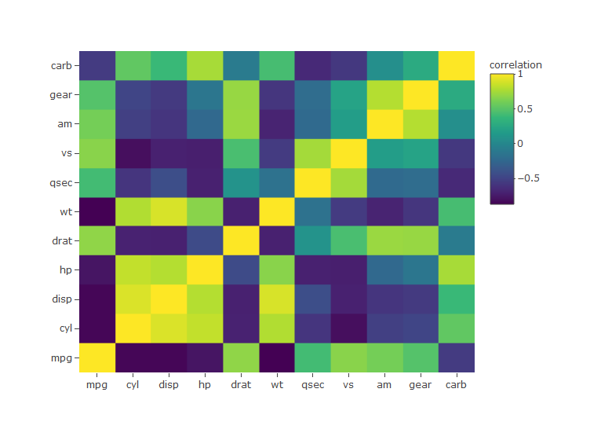

# <a href='https://maheshkulkarnix.github.io/corrlY/'></a>

### Corrly is a Data Visualization Package For All Types of Correlation Charts using Plotly Package.

## Install Corrly

``` r
library(plotly)
library(htmltools)
library(corrlY)
# install.packages("devtools")
#devtools::install_github("maheshKulkarniX/corrlY")
```

## correlation Coeficient using kendall Method

``` r
# source("R/corr_coef_kendall.R")
# Example: 
corr_coef_kendall(variable1= mtcars$cyl, variable2=mtcars$carb, decimal = 2) 
```

    ## [1] 0.47

## correlation Coeficient using pearson Method

``` r
# Example: 
# source("R/corr_coef_pearson.R")
corr_coef_pearson(variable1= mtcars$disp, variable2=mtcars$hp, decimal = 2)
```

    ## [1] 0.79

## correlation Coeficient using spearman Method

``` r
# Example:
# source("R/corr_coef_spearman.R")
corr_coef_spearman(variable1= cars$speed, variable2=cars$dist, decimal = 2)
```

    ## [1] 0.83

## Correlation Scatter Plot

``` r
# Example: 
# source("R/corr_scatterly.R")
spearman<- corr_coef_spearman(variable1= cars$speed, variable2=cars$dist, decimal = 2)
corr_scatterly(data=cars,x=cars$speed,y=cars$dist,corr_coef=spearman,xname="speed",yname="dist")
```

<!-- -->

## Correlation Matrix Plot

``` r
# Example: 
# source("R/matrixly.R")
matrixly(data = mtcars)
```

<!-- -->
